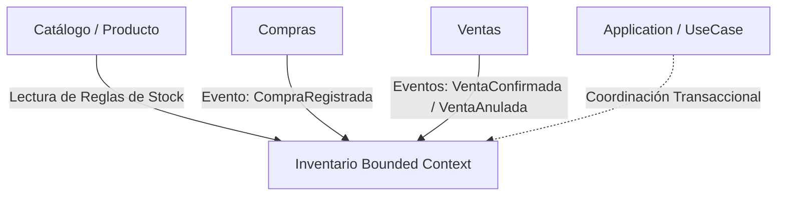

# 26_ANALISIS_FUNCIONAL_INVENTARIO.md

**Versión:** 1.0  
**Estado:** 📝 En Revisión (Fase 1: Análisis Funcional)  
**Última actualización:** 2026-07-23  
**Documento:** Análisis Funcional del Módulo de Inventario  

---

# 1. Objetivo del Bounded Context (Contexto Acotado)

El módulo de **Inventario** es el único propietario y responsable de la gestión de existencias y flujos físicos de productos dentro de CajaFácil. Su propósito principal es garantizar la trazabilidad absoluta del stock y proporcionar información confiable sobre la disponibilidad de los artículos para la venta y auditoría.

### Responsabilidades Clave:
* **Control de Existencias**: Mantener el balance de stock por producto bajo aislamiento multi-tenant.
* **Trazabilidad de Flujos**: Registrar cada entrada, salida y transferencia física mediante movimientos inmutables.
* **Gestión de Desviaciones**: Soportar mermas (pérdidas por daño/vencimiento) y ajustes correctivos (diferencias entre conteo físico y sistema).
* **Consumo de Catálogo**: Consultar los atributos de los productos (unidad, si maneja stock o si permite stock negativo).

### Fuera de Responsabilidad (Delegado a otros contextos):
* **Definición de Artículos**: El alta y modificación de productos es responsabilidad del módulo **Catálogo**.
* **Gestión de Precios e Impuestos**: Corresponde al módulo **Catálogo**.
* **Coordinación de Caja o Dinero**: Las transacciones financieras generadas por compras o ventas corresponden a **Caja** y **Ventas**.

---

# 2. Límites y Relaciones del Contexto (Context Boundaries)

El módulo de Inventario interactúa con los módulos existentes a través de los siguientes límites lógicos:

* **Catálogo (Producto) [Solo Lectura]**:
  * El inventario consulta a Catálogo para saber si un `ProductoId` existe, está activo, si `ManejaInventario` es verdadero y si `PermiteStockNegativo` está habilitado.
* **Ventas [Consumidor Indirecto / Eventos]**:
  * Al confirmarse una venta, se solicita una salida física de inventario (`SALIDA` por concepto `VENTA`).
  * Al anularse una venta, se solicita el reingreso físico de la mercancía (`ENTRADA` por concepto `ANULACION_VENTA`).
* **Compras [Consumidor Indirecto / Eventos]**:
  * Al registrarse una compra, se ingresa la mercancía al inventario (`ENTRADA` por concepto `COMPRA`).

---

# 3. Reglas de Negocio Clave (Invariantes y Políticas)

El comportamiento de la capa de dominio de Inventario se rige estrictamente por las siguientes reglas de negocio del sistema:

### Existencias e Inmutabilidad (Reglas Centrales)
* **RN-200 (Modificación Indirecta)**: Las existencias de un producto nunca se editan o modifican directamente (no existe una operación `set_stock`).
* **RN-201 (Trazabilidad de Movimientos)**: Todo cambio físico de existencias debe estar justificado por un registro inmutable de `MovimientoInventario`.
* **RN-202 (Cálculo Derivado - RN-203)**: El stock actual disponible se calcula mediante la agregación matemática de sus movimientos históricos:
  $$\text{Stock Disponible} = \sum (\text{Cantidad Entradas}) - \sum (\text{Cantidad Salidas})$$
* **RN-204 (Mermas como Salidas)**: Las mermas (daños, pérdidas o robos) se registran como movimientos de `SALIDA` bajo el concepto `MERMA` y requieren una justificación obligatoria.

### Invariantes de Validación en Movimientos
* **Manejo de Stock Activo**: No se pueden registrar movimientos sobre productos que tengan la bandera `ManejaInventario = False` en el Catálogo.
* **Control de Stock Negativo**:
  * Si el producto tiene `PermiteStockNegativo = False`, cualquier movimiento de `SALIDA` que resulte en un balance menor a cero ($0$) debe ser rechazado inmediatamente en el dominio arrojando una excepción de negocio (`StockInsuficienteException`).
* **Signo de Cantidades**: La cantidad de unidades en cualquier `MovimientoInventario` debe ser estrictamente positiva (mayor que cero).

---

# 4. Entidades y Componentes del Dominio

Durante esta fase funcional, identificamos las siguientes abstracciones clave del negocio:

1. **MovimientoInventario (Aggregate Root)**:
   * Representa la transacción elemental física.
   * *Atributos clave:* `Id`, `CompanyId`, `ProductId`, `Tipo` (Enum: `ENTRADA`, `SALIDA`), `Concepto` (Enum: `COMPRA`, `VENTA`, `ANULACION_VENTA`, `MERMA`, `AJUSTE`), `Cantidad`, `FechaMovimiento`, `DocumentoReferencia` (ID de venta o compra).
2. **Existencia / Stock (Read Model o Proyección)**:
   * Vista de lectura optimizada que acumula y expone la cantidad de stock actual disponible.
3. **Merma (Entidad)**:
   * Detalle de pérdida de valor físico de mercancía.
   * *Atributos clave:* `Id`, `MovimientoInventarioId` (relación 1:1), `Motivo` (vencimiento, daño, robo), `Observaciones`.
4. **AjusteInventario (Entidad)**:
   * Registro correctivo de discrepancias tras inventario físico.
   * *Atributos clave:* `Id`, `MovimientoInventarioId`, `CantidadFisica`, `CantidadSistema`, `Diferencia`, `ResponsableId`.

---

# 5. Casos de Uso del Negocio a Soportar

* **Registrar Entrada de Mercancía**: Incrementa existencias asociadas a compras o devoluciones de clientes.
* **Registrar Salida de Mercancía**: Reduce existencias asociadas a ventas confirmadas o mermas autorizadas.
* **Realizar Ajuste de Inventario**: Almacena discrepancias de stock físico y genera un movimiento correctivo (`ENTRADA` o `SALIDA` según la diferencia).
* **Registrar Merma**: Documenta y ejecuta la salida de inventario por pérdida física.
* **Consultar Existencias y Kardex**: Obtener el historial cronológico de flujos físicos de un producto (Kardex) y su saldo neto actual.

---

# 6. Eventos de Dominio a Publicar

Para notificar a otros contextos (por ejemplo, alertas de stock mínimo en Compras o Reportes de inventario):
* **`InventarioActualizado`**: Emite el `ProductId`, `StockActual`, `TipoMovimiento` y `Fecha`.
* **`MermaRegistrada`**: Publica el reporte de merma para auditoría financiera.
* **`AjusteInventarioRegistrado`**: Emite los detalles del ajuste correctivo y el usuario responsable.

---

# 7. Consideraciones para la Sincronización (Offline-First)

* Al operar sin internet, los movimientos se graban localmente en SQLite.
* **Resolución de Conflictos en Orden de Eventos**: Dado que el stock es acumulativo, el servidor debe procesar los movimientos según su `FechaMovimiento` de origen (marca de tiempo del cliente) y no según la hora de recepción, garantizando que el cálculo histórico mantenga coherencia lógica.
