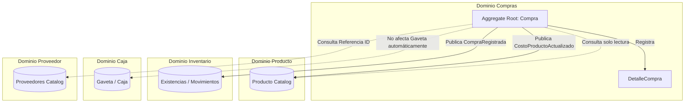

# Objetivo

Definir de manera formal y rigurosa el dominio del negocio para el módulo de **Compras** (Purchases) en CajaFácil, de acuerdo con los principios de Domain-Driven Design (DDD), garantizando el desacoplamiento de contextos y la inmutabilidad de los hechos históricos comerciales y costos de adquisición.

---

# 1. Definición del Dominio Compras

## ¿Qué es una Compra dentro del dominio?
La **Compra** es un hecho comercial histórico e inmutable que registra la adquisición de bienes o servicios provenientes de un proveedor bajo condiciones económicas determinadas.

La Compra no es un mecanismo para actualizar existencias ni para gestionar saldos en cuentas por pagar de forma directa. Representa el acuerdo comercial que formaliza la adquisición, conserva el costo histórico de adquisición acordado con el proveedor, y sirve como el origen documental que justifica la entrada de inventario.

## Responsabilidad Exclusiva del Contexto
- **Registrar la transacción comercial**: Registrar la adquisición de bienes o servicios detallando cantidades, costos unitarios de adquisición, descuentos e impuestos aplicables.
- **Mantener consistencia matemática comercial**: Calcular de forma rigurosa los importes totales (subtotales, descuentos, impuestos y totales generales) de la compra a partir de sus líneas de detalle.
- **Conservar costos históricos**: Guardar de forma inmutable el costo acordado de adquisición en el momento del registro comercial.
- **Registrar devoluciones al proveedor**: Gestionar el flujo comercial de la devolución total o parcial de productos adquiridos, en caso de que el proveedor la acepte.
- **Publicar eventos de dominio**: Informar mediante eventos a los dominios de Inventario (para que registre el incremento en existencias) y Producto (para reportar la actualización de costos).

## Lo que NO es responsabilidad de Compras
- **Existencias físicas (Stock) y Kardex**: El control físico de mercancías y su balance de movimientos corresponde al contexto de [Inventario](file:///docs/business/07_DOMINIO_INVENTARIO.md).
- **Flujo de caja y dinero físico**: La salida de efectivo de la gaveta o las transferencias bancarias de pago pertenecen al contexto de [Caja](file:///docs/business/10_DOMINIO_CAJA.md) y Pagos.
- **Administración del catálogo de productos**: El registro de marcas, categorías y códigos maestros de productos pertenece al contexto de [Producto](file:///docs/business/04_DOMINIO_PRODUCTO.md).
- **Precios de venta al público**: El establecimiento y la modificación de los precios de venta a clientes es responsabilidad exclusiva de los usuarios autorizados en los dominios de Producto o Ventas.
- **Administración de Utilidad y Margen**: El cálculo de la utilidad bruta y márgenes comerciales es una función analítica y de reportes.
- **Gestión maestra de Proveedores**: La administración del perfil comercial detallado del proveedor pertenece a su propio subdominio; Compras solo consume y referencia su identificador.

---

# 2. Modelo de Agregados del Dominio

## Aggregate Root: Compra
El agregado `Compra` encapsula la cabecera del documento comercial y sus respectivos detalles, asegurando que las invariantes de negocio se cumplan de manera atómica.

### Entidades y Conceptos Internos
- **Compra** (Aggregate Root): Representa el documento comercial de compra, inmutable una vez registrado.
- **DetalleCompra** (Entidad interna): Línea de detalle que asocia un producto con su cantidad, costo de adquisición unitario pactado, porcentaje o monto de descuento, y tasa de impuesto aplicada.

### Value Objects
- **NumeroCompra**: Representa el número correlativo interno o el número de factura/documento provisto por el proveedor (número de documento obligatorio).
- **EstadoCompra**: Estado del ciclo de vida de la transacción comercial (`BORRADOR`, `REGISTRADA` o `ANULADA`).
- **Dinero**: Estructura de valor que encapsula los importes económicos en una moneda específica, impidiendo operaciones matemáticas inconsistentes entre diferentes divisas.
- **Cantidad**: Representa la cantidad física adquirida. Soporta valores decimales para productos vendidos a granel o fraccionados.

### Identificadores y Referencias Externas
- **CompraId** (UUID): Identificador único global de la compra para soporte offline-first.
- **EmpresaId** (UUID): Referencia a la empresa (inquilino/tenant) propietaria de la transacción.
- **ProveedorId** (UUID): Referencia inmutable al proveedor que suministra los bienes.
- **ProductoId** (UUID): Referencia inmutable en cada línea de detalle al catálogo de productos.
- **UsuarioId** (UUID): Referencia al usuario (comprador/operador) que registra la operación.

---

# 3. Decisiones sobre el Ciclo de Vida y Estados

## Estados de la Compra
El flujo transaccional en CajaFácil V1 restringe los estados del agregado a los siguientes valores:

- **BORRADOR**:
  - Representa una compra en proceso de preparación.
  - Se permite la edición libre de la cabecera (proveedor, fecha) y de las líneas de detalle (añadir, modificar cantidades, modificar costos, eliminar).
- **REGISTRADA**:
  - Estado definitivo e inmutable que representa la consolidación del acuerdo comercial.
  - Al pasar a este estado, se asume que la mercancía ha sido recibida físicamente en su totalidad.
  - Publica de forma atómica los eventos `CompraRegistrada` y `CostoProductoActualizado`.
- **ANULADA**:
  - Estado que representa la reversión comercial de una compra previamente registrada.
  - No elimina el registro histórico del sistema.
  - Publica el evento `CompraAnulada` para que el dominio de Inventario deduzca las existencias asociadas.
  - Una compra en estado `ANULADA` es definitiva y no puede reactivarse.

### Nota sobre Recepción de Mercancías
Para CajaFácil V1, la decisión oficial es que **registrar una compra implica que la mercancía fue recibida completamente**. Se eliminan del alcance de la V1 los conceptos de `RecepcionCompra` y `RecepcionRegistrada`.

> [!NOTE]
> Las recepciones parciales y el seguimiento de órdenes de compra pendientes quedan fuera del alcance de la versión 1.0. Sin embargo, la estructura del agregado `Compra` y el modelo de eventos están diseñados de tal manera que esta funcionalidad podrá incorporarse en versiones futuras sin romper el núcleo de dominio actual (por ejemplo, introduciendo un estado `REGISTRADA_PARCIAL` o un agregado independiente de `Recepcion` que consuma el ID de compra).

---

# 4. Operaciones de Negocio del Agregado

Debido a los requerimientos de ciclo de vida e inmutabilidad, las operaciones disponibles sobre el agregado son:

- **Crear Compra (Factory/Constructor)**: Instancia un nuevo agregado en estado `BORRADOR`.
- **Actualizar Detalles (en Borrador)**: Permite añadir, modificar o remover líneas de detalle. Consolida automáticamente las cantidades si se intenta agregar un producto duplicado.
- **Registrar Compra**: Cambia el estado de `BORRADOR` a `REGISTRADA`. Valida todas las invariantes comerciales. Es un proceso irreversible. Genera los eventos `CompraRegistrada` y `CostoProductoActualizado`.
- **Anular Compra**: Cambia el estado de `REGISTRADA` a `ANULADA`. Requiere el ID del usuario con rol de supervisor que autoriza y una justificación textual. Genera el evento `CompraAnulada`.
- **Registrar Devolución al Proveedor**: Si tras el registro comercial y recepción física se determina la necesidad de retornar mercancía al proveedor, y este acepta la devolución, se registra este hecho comercial modificando las referencias históricas o generando un documento de devolución vinculado. Genera el evento `CompraDevueltaProveedor`.

---

# 5. Invariantes del Negocio (Reglas de Consistencia)

Para que el agregado `Compra` sea consistente y válido, debe garantizar el cumplimiento de las siguientes invariantes en todo momento:

1. **Invariante de Existencia Mínima**: Una compra debe contener obligatoriamente al menos una línea de `DetalleCompra`. No existen compras vacías.
2. **Invariante de Proveedor Obligatorio**: Toda compra debe tener asociado un `ProveedorId` válido. Se permite la asociación a un proveedor genérico provisto por el sistema para compras rápidas.
3. **Invariante de Cantidades Positivas**: La cantidad especificada en cada línea de detalle debe ser estrictamente mayor que cero (`cantidad > 0`).
4. **Invariante de Costos Positivos**: El costo unitario de adquisición pactado en cada línea de detalle debe ser estrictamente mayor que cero (`costo_unitario > 0`).
5. **Invariante de Total Coherente**: El subtotal, los descuentos, los impuestos y el total general de la compra deben ser calculados rigurosamente a partir de sus detalles bajo la siguiente formulación matemática:
   $$\text{TotalLínea} = (\text{Cantidad} \times \text{CostoUnitario}) - \text{Descuento} + \text{Impuesto}$$
   $$\text{TotalCompra} = \sum \text{TotalLínea}$$
6. **Invariante de Compra Registrada Inmutable**: Ningún dato de la cabecera ni de los detalles de una compra en estado `REGISTRADA` puede ser editado, añadido, removido o modificado.
7. **Invariante de Compra Anulada Irreversible**: Una compra en estado `ANULADA` es definitiva, su estado es inmutable y no puede volver a estado `REGISTRADA` o `BORRADOR`.
8. **Invariante de Producto Único por Compra**: Un producto (`ProductoId`) solo puede aparecer una vez en la lista de detalles de la compra. Si se agrega de nuevo, sus cantidades y costos ponderados deben consolidarse en una sola línea.

---

# 6. Reglas de Negocio Oficiales (Serie RN-300)

## RN-301: Cabecera + Detalles
Toda compra se compone de datos generales de cabecera (Empresa, Proveedor, Número de Documento, Fecha de Emisión, Estado) y de un listado de detalles con los productos adquiridos.

## RN-302: Totales Calculados
Todos los subtotales y el total general de la compra se calculan y consolidan dinámicamente en base a las cantidades, costos unitarios de adquisición, descuentos e impuestos de las líneas de detalle.

## RN-303: Compra Registrada Inmutable
Una vez que una compra ha sido registrada en el sistema, su contenido es inmutable y pasa a formar parte del histórico contable y de auditoría del negocio.

## RN-304: Proveedor Obligatorio
Toda compra debe estar vinculada a un proveedor registrado en el sistema. En caso de no contar con la ficha del proveedor, se utilizará un registro de "Proveedor Genérico" preconfigurado.

## RN-305: Historial de Costos por Proveedor
El dominio de Compras mantiene un registro histórico inmutable de los costos unitarios acordados con cada proveedor para fines de análisis de precios y auditorías de adquisición.

## RN-306: Devolución vs Merma
Si se requiere retornar mercancía al proveedor y este **acepta la devolución**, se registra una "Devolución al Proveedor" en Compras (disparando el evento correspondiente). Si el proveedor **rechaza la devolución** de un producto defectuoso o no conforme, el proceso de salida de inventario debe continuar y registrarse bajo el concepto de **Merma** en el dominio de [Inventario](file:///docs/business/07_DOMINIO_INVENTARIO.md).

## RN-307: Producto Único por Compra
Un mismo producto no puede registrarse en múltiples líneas de detalle de una misma compra. El sistema debe consolidar las líneas de forma automática sumando las cantidades.

## RN-308: Notificación de Costo sin Modificación del Precio de Venta
Una compra nunca modifica automáticamente el precio de venta del producto al público. El cambio en el costo unitario de adquisición genera una alerta/notificación al usuario autorizado (a través del evento `CostoProductoActualizado`), siendo decisión exclusiva de dicho usuario reajustar o no los márgenes de ganancia.

## RN-309: Costos Históricos e Inmutables
Los costos de adquisición registrados en una compra representan el hecho histórico en la fecha pactada y no varían bajo ninguna circunstancia retrospectiva, sirviendo de base para la valorización del inventario.

## RN-310: Recepción Completa en V1
En CajaFácil V1, registrar una compra bajo el estado `REGISTRADA` implica de manera obligatoria la recepción física completa de los bienes detallados.

---

# 7. Eventos de Dominio

El dominio publica los siguientes eventos integradores:

- **`CompraRegistrada`**:
  - *Cuándo se dispara:* Al transicionar con éxito al estado `REGISTRADA`.
  - *Payload mínimo:* `CompraId`, `EmpresaId`, `ProveedorId`, `Detalles` (`ProductoId`, `Cantidad`, `CostoUnitario`), `FechaRegistro`.
  - *Objetivo:* Permite que el dominio de Inventario incremente el stock físico y registre el movimiento de entrada de mercancía.
- **`CompraAnulada`**:
  - *Cuándo se dispara:* Al transicionar al estado `ANULADA` desde el estado `REGISTRADA`.
  - *Payload mínimo:* `CompraId`, `EmpresaId`, `Detalles` (`ProductoId`, `Cantidad`), `UsuarioId` (Autorizador), `MotivoAnulacion`, `FechaAnulacion`.
  - *Objetivo:* Permite que el dominio de Inventario registre una salida de stock compensatoria de forma automática para reversar la entrada original.
- **`CompraDevueltaProveedor`**:
  - *Cuándo se dispara:* Al registrar comercialmente el retorno de mercancía aceptado por el proveedor.
  - *Payload mínimo:* `CompraId`, `EmpresaId`, `Detalles` (`ProductoId`, `Cantidad`), `ProveedorId`, `FechaDevolucion`.
  - *Objetivo:* Permite que el dominio de Inventario registre una salida física por devolución a proveedor.
- **`CostoProductoActualizado`**:
  - *Cuándo se dispara:* Al registrar una compra donde el costo unitario del producto es diferente al último registrado.
  - *Payload mínimo:* `EmpresaId`, `ProductoId`, `NuevoCostoAdquisicion`, `FechaActualizacion`.
  - *Objetivo:* Informa que el costo de adquisición de un producto ha cambiado, facilitando notificaciones al administrador del catálogo sin modificar el precio de venta de forma automática.

---

# 8. Integraciones del Dominio

Para mantener el acoplamiento al mínimo y respetar la arquitectura modular de CajaFácil, las integraciones se realizan bajo las siguientes directivas:

- **Integración con Producto**:
  - **Consulta:** Compras realiza lecturas del catálogo de productos únicamente para validar la existencia del `ProductoId` y consultar tasas tributarias asignadas.
  - **Modificación:** Compras **nunca** actualiza el catálogo, precios de venta, descripción o códigos de productos.
- **Integración con Inventario**:
  - **Desacoplamiento:** Compras **nunca** modifica las tablas de existencias ni de Kardex directamente.
  - **Mecanismo:** El incremento de stock se realiza de forma reactiva y asíncrona. Inventario escucha el evento `CompraRegistrada` y crea un `MovimientoInventario` de tipo `ENTRADA_POR_COMPRA`.
  - En caso de anulación, Inventario escucha `CompraAnulada` y genera un `MovimientoInventario` de tipo `SALIDA_POR_ANULACION_COMPRA`.
- **Integración con Caja**:
  - **Desacoplamiento:** Compras **nunca** afecta la gaveta ni crea movimientos de efectivo de forma automática.
  - **Mecanismo:** La liquidación financiera de la compra a nivel de salida de dinero se delega enteramente al dominio de Caja, que registra egresos vinculados a cuentas por pagar o egresos de caja chica según el flujo administrativo del negocio.
- **Integración con Proveedor**:
  - Compras únicamente almacena de forma persistente la clave foránea/referencia `ProveedorId`. La gestión de datos maestros del proveedor (nombre, dirección, teléfono, etc.) se realiza de manera independiente en su contexto propio.

---

# 9. Filosofía del Dominio

> [!IMPORTANT]
> **Filosofía del Dominio CajaFácil**
> "Compras registra acuerdos comerciales.
> Inventario administra existencias.
> Caja administra dinero.
> Producto administra el catálogo.
> Cada dominio es propietario exclusivo de sus reglas y datos."
