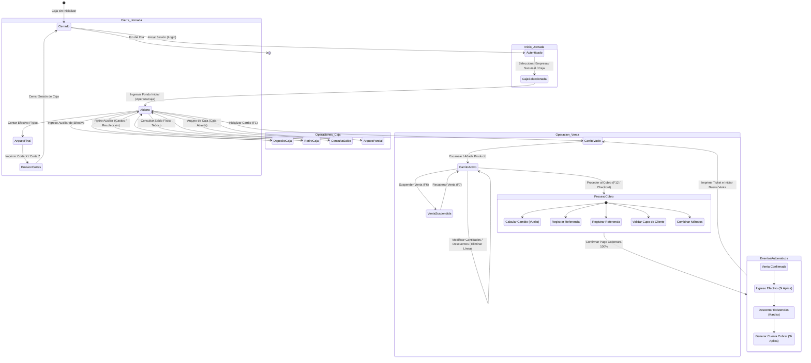

# Capacidad: Operación Diaria

> [!NOTE]
> Este documento depende de las especificaciones canónicas de los dominios del Core 1.0 de CajaFácil:
> - [Dominio de Ventas](file:///docs/business/dominios/09_DOMINIO_VENTAS.md) (CF-DOC-011)
> - [Dominio de Caja](file:///docs/business/dominios/10_DOMINIO_CAJA.md) (CF-DOC-010)
> - [Reglas de Negocio](file:///docs/business/06_REGLAS_DE_NEGOCIO.md) (CF-DOC-008)
> - [Dominio Clientes y Crédito](file:///docs/business/dominios/11_DOMINIO_CLIENTES_CREDITO.md)

---

## Introducción y Propósito

Este documento establece la especificación funcional oficial para la capacidad de **Operación Diaria** de CajaFácil. Su objetivo es diseñar e integrar el comportamiento conjunto de los dominios core (Empresa, Producto, Inventario, Caja, Ventas, Clientes y Crédito) durante una jornada operativa del negocio minorista. 

La capacidad de Operación Diaria describe detalladamente el flujo de trabajo completo del personal del punto de venta (POS) desde que se abren las cortinas del negocio hasta su arqueo y cierre físico nocturno. Esta especificación sirve de base absoluta y de guía inequívoca para los diseñadores de Experiencia de Usuario (UX), diseñadores de Interfaz de Usuario (UI), desarrolladores Frontend y equipos de Control de Calidad (QA).

---

## 1. Principios Operativos del POS

La filosofía del producto CajaFácil se rige por un conjunto de directrices operativas que garantizan la agilidad, robustez y resiliencia en el mostrador. Toda decisión de diseño de pantalla e interacción debe estar alineada con estos principios:

### A) Nunca detener al cajero innecesariamente
- **Descripción**: La interfaz debe procesar y reaccionar de forma inmediata. No se deben presentar pantallas modales de confirmación o de éxito (tipo "Venta registrada con éxito, presione Aceptar") que requieran atención física y detengan el flujo del cajero.
- **Justificación**: En horas pico, cada segundo ahorrado en el escaneo y cobro reduce las colas, mejora la satisfacción del cliente y evita cuellos de botella operativos en el mostrador.

### B) Nunca perder una venta
- **Descripción**: El sistema debe estar diseñado para facturar bajo cualquier circunstancia física adversa (fallas de red, pérdida de conexión a base de datos centralizada, etc.).
- **Justificación**: Un POS que se detiene por falta de internet representa pérdidas económicas inmediatas y desconfianza en el cliente. La continuidad operativa es la prioridad número uno.

### C) Priorizar teclado sobre mouse
- **Descripción**: El 100% del flujo transaccional (desde la apertura de caja hasta el cierre) debe ser ejecutable utilizando atajos del teclado. El cursor debe retornar y enfocarse automáticamente en el campo de escaneo principal tras cada acción.
- **Justificación**: El uso del mouse obliga al cajero a retirar la mano del teclado y desviar la vista de los productos físicos, duplicando los tiempos de operación de mostrador.

### D) Mouse opcional (Respaldo táctil)
- **Descripción**: El mouse es un mecanismo de respaldo o exploración secundaria. La interfaz debe poseer botones interactivos visibles con sus respectivos atajos de teclado rotulados, permitiendo el uso táctil (touchscreen) o click de mouse para el personal en entrenamiento.
- **Justificación**: Permite una curva de aprendizaje baja para cajeros novatos sin sacrificar la velocidad de los cajeros expertos.

### E) Minimizar confirmaciones
- **Descripción**: Las tareas rutinarias y repetitivas (agregar productos, cambiar precios configurados, seleccionar consumidor final) no deben solicitar confirmación del usuario. Las confirmaciones modales se reservan estrictamente para acciones destructivas.
- **Justificación**: Evita la "ceguera de confirmación", donde el usuario presiona "Sí" mecánicamente a cada popup sin leer el contenido, invalidando el propósito de la confirmación misma.

### F) Confirmar únicamente acciones destructivas
- **Descripción**: Solo se requiere una confirmación modal y explícita cuando la acción resulte en pérdida irreversible de trabajo o tenga implicaciones financieras críticas.
- **Ejemplos**: Cancelación del carrito de compras activo (`ESC`), salida del turno de caja sin arqueo y anulación de facturas emitidas.
- **Justificación**: Protege la integridad de los datos del negocio y previene pérdidas accidentales por errores de digitación rápida.

### G) Continuar operando sin Internet (Offline-First)
- **Descripción**: Toda la lógica del negocio (cálculo de impuestos, descuentos, validación de stock caché local, checkout) se ejecuta de forma local. La conexión a la red de nube centralizada ocurre en segundo plano de manera asíncrona.
- **Justificación**: Asegura la independencia de la terminal física ante inestabilidades del proveedor de internet local, manteniendo el mostrador activo de manera ininterrumpida.

### H) Mantener la continuidad del trabajo
- **Descripción**: Ante un cierre inesperado del software o un fallo físico de energía, la pantalla del POS debe restaurar exactamente el último estado en el que se encontraba (el carrito activo con sus ítems cargados y la sesión de caja intacta) al reiniciarse la terminal.
- **Justificación**: Evita tener que re-escanear una compra grande a la mitad del checkout, minimizando la frustración del cajero y del cliente afectado.

---

## 2. Objetivos de Interacción y Rapidez

Los siguientes objetivos definen las metas de diseño de producto y el costo de interacción física para los flujos más recurrentes de la operación diaria.

### A) Venta Rápida (Escaneo Continuo)
- **Clics de mouse**: 0
- **Uso del teclado**: 100% (solo escáner enviando código + `Enter`).
- **Cantidad de pasos**: 1 (pasar el producto por el lector).
- **Meta de rapidez**: < 100 ms por producto ingresado. El cursor permanece en el campo de entrada listo para el siguiente artículo.

### B) Búsqueda Manual de Producto
- **Clics de mouse**: 0
- **Uso del teclado**: 100% (Escribir letras -> Flechas arriba/abajo -> `Enter`).
- **Cantidad de pasos**: 2 (comenzar a escribir el nombre del artículo y presionar `Enter` en la sugerencia seleccionada).
- **Meta de rapidez**: < 200 ms en mostrar sugerencias dinámicas autocompletables.

### C) Suspensión de Venta (Hold)
- **Clics de mouse**: 0
- **Uso del teclado**: 100% (presionar `F6`).
- **Cantidad de pasos**: 1 (presionar atajo y confirmar instantáneamente en background).
- **Meta de rapidez**: < 800 ms. Limpia la pantalla y abre un nuevo carrito de inmediato.

### D) Recuperación de Venta (Resume)
- **Clics de mouse**: 0
- **Uso del teclado**: 100% (`F7` -> Flechas para elegir de la cola -> `Enter`).
- **Cantidad de pasos**: 2 (abrir cola y seleccionar ticket).
- **Meta de rapidez**: < 1.5 segundos en reconstruir el carrito seleccionado en pantalla.

### E) Checkout de Efectivo (Método Estándar)
- **Clics de mouse**: 0
- **Uso del teclado**: 100% (`F12` / `+` -> Digitar efectivo recibido o seleccionar billete sugerido -> `Enter`).
- **Cantidad de pasos**: 2 (abrir cobro y presionar Enter para confirmar pago).
- **Meta de rapidez**: < 2.0 segundos totales desde que se abre el panel de cobro hasta que se envía la orden de impresión térmica.

### F) Retiro Auxiliar de Caja
- **Clics de mouse**: 0
- **Uso del teclado**: 100% (`F11` -> Elegir Retiro -> Digitar Monto -> Escribir Justificación -> `Enter`).
- **Cantidad de pasos**: 3 (abrir menú auxiliar, rellenar formulario breve y guardar).
- **Meta de rapidez**: < 10 segundos en completarse por parte del operador.

---

## 3. Atajos Oficiales del POS (Hotkeys)

Los atajos de teclado están asignados de manera ergonómica para favorecer la mano izquierda en la zona de funciones (`F1`-`F12`, `ESC`) y la mano derecha en el bloque numérico (`+`, `Enter`, `DEL`).

| Tecla / Atajo | Acción Oficial en POS | Justificación Ergonómica y Usabilidad |
| :--- | :--- | :--- |
| **`F1`** | **Nueva Venta / Limpiar Carrito** | Permite reiniciar el mostrador rápidamente tras una venta. Ubicada en la esquina superior izquierda para fácil localización sin ver el teclado. |
| **`F2`** | **Seleccionar / Buscar Cliente** | Abre el buscador de clientes. Permite asociar una venta nominativa o validar crédito antes de comenzar la compra. |
| **`F3`** | **Consulta Lateral (Precios/Stock)** | Abre y cierra el visor lateral flotante. Permite responder consultas de clientes sobre otros productos sin perder los ítems que ya están en el carrito. |
| **`F4`** | **Agregar Producto Genérico** | Permite la facturación rápida de artículos especiales o servicios sin código máster, ingresando precio y descripción manual. |
| **`F5`** | **Modificar Cantidad de Línea** | Enfoca el campo de cantidad de la línea seleccionada en el carrito para actualización rápida (ej. cambiar 1 a 12 unidades). |
| **`F6`** | **Suspender Carrito (Hold)** | Coloca la venta activa en la cola local temporal de espera para liberar la caja ante inconvenientes del cliente. |
| **`F7`** | **Ver/Recuperar Suspendidas** | Abre la cola de tickets suspendidos en espera para reanudar el cobro de inmediato. |
| **`F8`** | **Buscador Avanzado Catálogo** | Abre una ventana modal de catálogo completo con filtros y visualización de stock para cuando el cajero desconoce el código y el nombre. |
| **`F9`** | **Aplicar Descuento** | Abre la ventana de descuento (porcentaje o valor) sobre el producto seleccionado o sobre el total de la venta. |
| **`F11`** | **Panel Auxiliar de Caja** | Abre el menú para realizar arqueos intermedios, depósitos, retiros auxiliares y cierre de caja. |
| **`F12`** o **`+`** (Num) | **Proceder al Checkout (Cobro)** | Dispara la pantalla de selección de métodos de pago. El uso del signo `+` del teclado numérico permite ingresar al cobro sin retirar la mano derecha del bloque numérico. |
| **`ESC`** | **Cancelar / Limpiar Carrito** | Limpia el carrito activo (requiere confirmación `Y`/`N`). Sirve también para cerrar cualquier panel modal o ventana emergente y regresar el foco al buscador. |
| **`DEL`** | **Eliminar Línea Seleccionada** | Borra el producto seleccionado en la grilla del carrito. Atajo rápido y directo de remoción. |
| **`Enter`** | **Confirmar Acción / Venta** | Funciona como confirmación universal en diálogos y finalización de cobros en pantalla de checkout. |
| **`Flechas ↑ / ↓`** | **Navegar Grilla del Carrito** | Permite al cajero moverse entre los diferentes productos cargados en la grilla activa para modificarlos o borrarlos. |

---

## 4. Integración Funcional con Hardware

El POS de CajaFácil interactúa con periféricos externos mediante los siguientes comportamientos funcionales esperados:

### A) Lector de Códigos de Barras
- **Comportamiento**: El lector debe emular un teclado USB (Keyboard Wedge) enviando el código numérico y un sufijo de retorno de carro (`Enter`).
- **Mecanismo del POS**: La ventana principal posee un listener global que detecta la entrada rápida de caracteres. Si el lector envía un código, el POS captura la cadena, detiene cualquier entrada manual del cajero por una fracción de segundo, busca el código en la base local y agrega el producto al carrito. No debe requerir que el cajero haga clic previo sobre la barra de búsqueda.

### B) Impresora Térmica de Tickets (Ticketera)
- **Comportamiento**: Al confirmarse un cobro o una operación auxiliar (apertura, retiro, arqueo, cierre), el POS genera un documento de texto formateado en comandos ESC/POS y lo envía al spooler de impresión local.
- **Flujo**: La impresión es asíncrona; el cajero no debe experimentar bloqueos de pantalla esperando la respuesta física de la impresora. La pantalla del POS se limpia para una nueva venta inmediatamente al enviar los datos a la cola de impresión local.

### C) Gaveta de Dinero (Cajón de Efectivo)
- **Comportamiento**: La gaveta de dinero física está conectada directamente a la impresora térmica mediante un cable RJ11.
- **Mecanismo del POS**: Al procesar una venta pagada total o parcialmente con la forma de pago **Efectivo**, o al realizar operaciones auxiliares de tipo **Retiro** o **Arqueo**, el POS envía el comando eléctrico de apertura (`pulse`) a la impresora térmica. Esto abre automáticamente la gaveta para depositar el dinero y dar el cambio de forma ágil. Para cobros con Tarjeta, Transferencia o Crédito, la gaveta permanece cerrada por seguridad.

### D) Báscula / Balanza Electrónica
- **Comportamiento**: Utilizada para productos a granel. 
- **Mecanismo del POS**: Al ingresar al carrito un producto configurado como "Decimal (Peso)", el POS lee el puerto serial/USB configurado de la balanza en tiempo real. La interfaz del POS muestra el peso actual de la báscula de forma dinámica en pantalla. Cuando se estabiliza la báscula, el cajero presiona `Enter` y el peso se consolida automáticamente como la cantidad de la línea del carrito.

### E) Visor para Cliente (Customer Display)
- **Comportamiento**: Pequeña pantalla digital orientada al cliente.
- **Mecanismo del POS**: El POS envía de forma continua el nombre del producto escaneado y su precio actual. Al abrirse la pantalla de cobro, el visor muestra: *"TOTAL A PAGAR: L XX.XX"*. Al finalizar el checkout, muestra: *"CAMBIO / VUELTO: L XX.XX"*. Si la caja entra en reposo, muestra un mensaje de bienvenida personalizado por la empresa.

### F) Terminal de Pago Bancario (Datáfono - Futuro)
- **Comportamiento**: Integración transaccional con terminales de tarjetas.
- **Mecanismo del POS**: En el MVP, el cobro es ciego (el cajero pasa la tarjeta por el datáfono físico independiente e introduce manualmente la referencia en el POS). En futuras fases de integración directa, al seleccionar "Tarjeta" en el checkout, el POS enviará el monto al datáfono por red o cable y esperará de forma no bloqueante la respuesta de "Aprobado" o "Rechazado" para avanzar en el checkout de manera automática.

---

## 5. Operaciones en Contingencia

Las siguientes especificaciones describen la resiliencia del punto de venta ante eventos excepcionales, garantizando que el comercio nunca detenga su operación y que la información esté protegida.

### A) Pérdida Repentina de Energía Eléctrica
- **Problema**: El equipo de computación de la caja se apaga a la mitad de una transacción por corte eléctrico.
- **Comportamiento esperado**: La base de datos local SQLite cuenta con transacciones atómicas seguras y el motor de ventas realiza un autoguardado continuo de la sesión activa en una tabla temporal. Al reencender el equipo e iniciar sesión el cajero, el POS recupera de inmediato el estado exacto del carrito y la sesión de caja antes del corte, permitiendo continuar con el cobro o anularlo sin pérdida de datos del inventario o caja.

### B) Cierre Inesperado de la Aplicación (Crash)
- **Problema**: La aplicación POS se cierra inesperadamente debido a una falla del sistema operativo o del framework de Flutter.
- **Comportamiento esperado**: Al igual que ante la pérdida de energía, el sistema no limpia la sesión activa de caja en la base de datos persistente. La sesión se reanuda de forma inmediata al volver a abrir la aplicación, restaurando los productos que estaban escaneados en el carrito activo del cajero.

### C) Impresiones Pendientes en Cola (Spooler local)
- **Problema**: La ticketera se queda sin papel térmico o experimenta un atasco físico mientras se emite una factura.
- **Comportamiento esperado**: El POS no aborta ni revierte la venta en el dominio, ya que la propiedad ya cambió y el pago fue recibido. La factura física se guarda en una cola local de impresión con estado "Pendiente". El POS muestra una notificación de advertencia en la esquina de la pantalla. Una vez corregido el problema físico del hardware, el cajero puede presionar un botón de "Reintentar Impresiones Pendientes" o reimprimir directamente el último ticket desde el historial rápido.

### D) Sincronización Diferida y Pérdida Prolongada de Internet
- **Problema**: La terminal del POS pierde conexión con la nube durante horas o días.
- **Comportamiento esperado**: El motor operativo continúa permitiendo login local (usando credenciales cacheadas cifradas), apertura de turnos, escaneo de productos, validación de stock de sucursales en base local, y cobros. 
- **Resolución**:
  - Los eventos de dominio generados (`VentaConfirmada`, `MovimientoCajaRegistrado`, `MovimientoInventarioRegistrado`) se encolan en una tabla local SQLite de sincronización (`sync_queue`).
  - Al restaurarse la red, un demonio en segundo plano envía las transacciones de forma asíncrona por lotes (batch) a la API SaaS central de CajaFácil.
  - Si ocurren conflictos de stock (venta offline de un producto con stock cero en la nube), el servidor central procesa la venta, ajusta el inventario y notifica una alerta al dashboard de administración en un log de conciliación de inventario (`conflict_stock_log`), pero nunca bloquea la venta del cajero local.

---

## 6. Objetivos de Rendimiento del Producto (Metas de Diseño)

| Evento de Operación | Meta de Producto (Límite Máximo) | Justificación de Negocio |
| :--- | :--- | :--- |
| **Inicio de Jornada (Login y Carga)** | < 3.0 segundos | El cajero no debe hacer esperar al primer cliente del día. |
| **Creación / Inicio de Sesión de Caja** | < 1.0 segundos | El proceso de validación e inserción de fondo inicial debe ser instantáneo. |
| **Apertura de Carrito Vacío** | < 0.2 segundos | Cero retardo perceptual al finalizar una venta y prepararse para la siguiente. |
| **Lectura de Código / Escaneo de Ítem** | < 0.1 segundos ($100\text{ ms}$) | El escaneo debe procesarse de manera inmediata en flujo continuo de mostrador. |
| **Búsqueda Autocompletable de Producto** | < 0.2 segundos ($200\text{ ms}$) | La búsqueda incremental por nombre no debe pausar la escritura. |
| **Suspensión de Venta (Hold)** | < 0.8 segundos | Guardar el carrito activo debe liberar la pantalla del POS de inmediato. |
| **Recuperación de Venta (Resume)** | < 1.5 segundos | Recuperar una venta suspendida de la lista debe tardar menos de 2 segundos. |
| **Confirmación de Pago y Envío a Impresora** | < 2.0 segundos | La confirmación del checkout físico debe imprimir el ticket inmediatamente para el cliente. |

---

## 7. Diagrama de la Jornada Operativa Completa

El siguiente flujo representa la máquina de estados de la operación diaria del mostrador y su interacción con los distintos procesos transaccionales:

---

## 8. Actores Involucrados

Para garantizar la seguridad transaccional, CajaFácil define los siguientes perfiles de usuario en el POS:

1. **Cajero (Operador Principal)**:
   - **Responsabilidad**: Registrar ventas, suspender/recuperar carritos, realizar cobros, realizar depósitos/retiros auxiliares de caja y consultar precios/existencias.
   - **Restricción**: No puede anular ventas confirmadas, otorgar descuentos mayores a la política general configurada ni realizar retiros de efectivo sin justificación/autorización.
2. **Supervisor (Validador)**:
   - **Responsabilidad**: Autorizar excepciones en el punto de venta (descuentos mayores, eliminación de líneas críticas en caliente, anulación de ventas confirmadas y realización de arqueos intermedios).
   - **Acceso**: Puede introducir su PIN/credencial directamente sobre la pantalla del cajero sin cerrar la sesión de este.
3. **Administrador**:
   - **Responsabilidad**: Configurar las políticas del motor de ventas, dar de alta productos, asignar usuarios/roles, definir límites de caja, configurar sucursales y ver reportes de rentabilidad.
4. **Cliente**:
   - **Consumidor Final (No Identificado)**: Por defecto en ventas al contado (`RN-404`). No requiere datos personales.
   - **Cliente Identificado**: Obligatorio para créditos (`RN-601`). Permite acumular puntos, recibir facturas nominativas y aplicar precios preferenciales.

---

## 9. Inicio de Jornada (Detalles Adicionales)

El inicio de jornada garantiza que ningún cajero opere el sistema sin un flujo formal de responsabilidades financieras y trazabilidad de auditoría.

### Flujo de Operación Paso a Paso
1. **Autenticación (Login)**: El usuario introduce sus credenciales (o escanea su código de barras/tarjeta de empleado).
2. **Selección de Contexto**:
   - Si el usuario tiene acceso a múltiples Empresas, el sistema le obliga a seleccionar una (`RN-001`).
   - El sistema lista las Sucursales activas configuradas para la empresa elegida.
   - El sistema muestra las Cajas asignadas físicamente a esa Sucursal.
3. **Validación de Sesión Previa**:
   - **Verificación**: El sistema revisa si existe alguna `SesionCaja` abierta para la caja o el cajero seleccionado.
   - **Invariante**: Si la caja ya tiene una sesión abierta por otro cajero, el sistema bloquea el acceso e indica: *"La caja seleccionada está siendo operada por [Nombre del Cajero]. Debe cerrarse la sesión anterior antes de continuar"*.
4. **Declaración del Fondo Inicial**:
   - El cajero debe registrar obligatoriamente la cantidad de efectivo inicial presente en la gaveta física (caja chica).
   - **Regla**: El fondo inicial debe ser un número igual o mayor a cero.
5. **Apertura de Sesión**:
   - Al confirmar el fondo inicial, el sistema registra el evento `CajaAbierta`.
   - Se imprime automáticamente un comprobante físico de apertura en la ticketera para control de auditoría.
   - La caja pasa a estado `Abierta` en base de datos local y se habilita la pantalla de ventas.

---

## 10. Venta (Detalles de Carrito y Control)

El mostrador es el núcleo de CajaFácil. Su diseño está optimizado para que la interacción sea intuitiva y extremadamente rápida.

### El Carrito y la Pantalla de Ventas
La pantalla de ventas mantiene un diseño limpio y enfocado. El foco del teclado está permanentemente en la barra de búsqueda o escaneo principal. 

### Escaneo y Búsqueda de Productos
- **Escaneo Continuo**: Cuando el cajero pasa un artículo por el lector, este emite el código y un retorno de carro (`Enter`). El sistema intercepta el código, busca el producto en la caché local y lo agrega directamente al carrito sin abrir ninguna ventana de confirmación.
- **Búsqueda Incremental**: Si el producto no tiene etiqueta, el cajero puede escribir las primeras letras del nombre. La lista se autocompleta inmediatamente abajo del campo de búsqueda. Al presionar `Enter` en el ítem seleccionado, se inserta al carrito.
- **Búsqueda Detallada (`F8`)**: Abre una ventana de búsqueda de productos avanzada con filtros por categoría y marcas, mostrando stock actual.

### Reglas de Control sobre Ítems en Carrito
1. **Productos Repetidos**:
   - *Decisión UX*: Si se escanea un producto que ya se encuentra en el carrito, el sistema no agrega una nueva línea independiente. En su lugar, incrementa la cantidad en la línea existente (`Cantidad = Cantidad + 1`).
   - *Justificación*: Mantiene el ticket compacto y facilita la lectura rápida para el cliente y el cajero.
2. **Productos por Peso (Decimales / Balanza)**:
   - *Comportamiento*: Al ingresar un código configurado como "Venta Decimal / Granel" (ej. Tomates), el sistema detiene el flujo continuo y enfoca el campo "Cantidad". El cajero puede escribir el peso (ej. `1.250`) o el sistema lo lee automáticamente si hay una balanza conectada al puerto serial.
3. **Productos Sin Código (Genéricos)**:
   - *Comportamiento*: Para artículos sin código o servicios rápidos, existe un botón o acceso rápido (`F4`) para agregar un "Producto Genérico". Se abre una pequeña ventana para ingresar el precio de forma manual y un nombre genérico (ej. "Bolsa de Hielo").
4. **Descuentos**:
   - **Descuento por Línea**: Permite aplicar un descuento (porcentaje o monto fijo) a un artículo específico.
   - **Descuento General**: Aplica un descuento sobre el total del carrito.
   - *Seguridad*: Si el descuento supera la política máxima de la empresa para cajeros (ej. > 5%), la pantalla solicita el PIN de autorización del Supervisor de forma inmediata.
5. **Eliminación de Líneas y Cancelación de Venta**:
   - **Eliminar Línea (`DEL`)**: Borra la línea activa seleccionada del carrito. Para evitar fraudes (cajeros que cobran y borran ítems sin que el cliente lo note), el sistema registra cada eliminación en el log de auditoría. Si está configurado el modo estricto, requiere autorización del supervisor.
   - **Cancelar Venta (`ESC`)**: Limpia el carrito por completo. Esta acción destructiva requiere siempre confirmación (`Y`/`N`) y guarda el registro del intento cancelado para auditoría de prevención de pérdidas.

---

## 11. Ventas Suspendidas (Hold / Resume - Reglas)

En tiendas minoristas es muy frecuente que un cliente olvide su billetera o regrese al mostrador a buscar otro artículo, bloqueando la fila de pago. La suspensión de ventas resuelve este problema crítico.

### Reglas de Negocio
- **Límite de Ventas Suspendidas**: Se establece un límite máximo de **10 ventas suspendidas simultáneamente por cada caja registradora**.
  - *Justificación*: Evitar que la base de datos local y la memoria de la aplicación acumulen carritos obsoletos abandonados.
- **Sincronización**: Las ventas suspendidas pertenecen estrictamente a la sesión local de la terminal física. No se sincronizan en la nube.
- **Reserva de Stock**: **Una venta suspendida NO reserva existencias en el inventario**.
  - *Justificación*: Reservar stock por carritos suspendidos causaría sobreventa virtual en comercios de alto flujo. El stock se valida únicamente en el checkout final.

### Flujo Operativo de Suspensión
1. El cajero presiona `F6` mientras el carrito tiene productos.
2. El sistema guarda la sesión de venta en una tabla local temporal (SQLite) con la marca de tiempo y un identificador autogenerado (ej. *"Ticket Suspendido #01 (L 120.00)"*).
3. La pantalla del POS se limpia automáticamente y queda lista para atender al siguiente cliente en menos de 0.8 segundos.

### Flujo Operativo de Recuperación
1. El cajero presiona `F7`.
2. Se muestra un panel flotante o lateral con la lista de ventas suspendidas ordenada de forma cronológica (la más reciente primero).
3. El cajero selecciona el ticket mediante las flechas del teclado y presiona `Enter`.
4. El carrito se restaura exactamente como estaba antes de la suspensión, permitiendo seguir agregando productos o cobrar.

---

## 12. Checkout (Flujo de Cobro y Métodos)

El checkout es el momento más crítico para minimizar el tiempo de espera del cliente. CajaFácil permite liquidar el importe del carrito mediante múltiples formas de pago.

### Canales de Pago Disponibles
- **Efectivo**: El método más veloz. El sistema muestra botones inteligentes con montos sugeridos (ej. el importe exacto, el billete superior inmediato como L 200 o L 500). Al ingresar el monto recibido, el sistema calcula de forma gigante el **Cambio (Vuelto)** en pantalla.
- **Tarjeta**: Para registrar transacciones hechas en datáfonos independientes. El cajero introduce el monto cobrado y la referencia numérica del voucher emitido por el datáfono.
- **Transferencia**: Permite registrar pagos vía transferencias bancarias directas, billeteras electrónicas o códigos QR. Requiere registrar la referencia bancaria para conciliación.
- **Crédito**: Pago mediante cuenta de crédito interna.
  - **Invariante**: Obliga a que el cliente esté plenamente identificado en el POS (`RN-601`). El sistema valida que el saldo disponible del cliente sea mayor o igual al monto de crédito solicitado.
- **Pago Mixto (Combinado)**: Permite pagar con múltiples métodos en la misma venta (ej. L 100 en efectivo y L 59 con tarjeta). El checkout permanece abierto y no permite la confirmación final hasta que la suma de los montos ingresados cubra exactamente el 100% del total del ticket.

### Confirmación Final
Al presionar `Enter` con el cobro completado, se dispara el proceso de persistencia atómica y emisión física del ticket.

---

## 13. Eventos y Acciones Automáticas Post-Venta

Una vez confirmada la venta en el mostrador, ocurren una serie de integraciones lógicas que aseguran que el ERP/SaaS esté al día. Esto se procesa de forma atómica a través de eventos de dominio de la siguiente manera:

1. **Registrar Venta**: Se persiste el agregado `Venta` con estado `Confirmada` junto a sus detalles y formas de pago aceptadas.
2. **Registrar Movimiento en Caja**: El dominio Caja recibe la notificación e inserta un `MovimientoCaja` de tipo "Ingreso por Venta" por los importes en efectivo, tarjeta o transferencia recibidos.
3. **Registrar Movimiento de Inventario**: El dominio Inventario inserta un `MovimientoInventario` de salida de tipo "Venta" para cada artículo vendido, actualizando la caché de existencias (`ExistenciaProducto`).
4. **Registrar Deuda**: Si se utilizó el método de pago Crédito, el dominio Crédito registra un movimiento de `Deuda` para el Cliente, aumentando su saldo adeudado y reduciendo su cupo disponible.
5. **Comprobante de Venta**: Se envía la factura formateada al motor de impresión local para salida física térmica.

---

## 14. Operaciones Auxiliares de Caja (Control Gaveta)

El control de la gaveta física requiere que los flujos monetarios no relacionados con ventas directas sean registrados de manera formal (`RN-501`).

### A) Depósitos (Ingreso de Efectivo)
- **Caso de Uso**: El administrador inyecta dinero a la caja para cambio (vencimiento de billetes grandes) o por un préstamo transitorio.
- **Flujo**: El cajero registra el monto y selecciona la categoría (ej. *"Ingreso para Cambio"*). Genera un `MovimientoCaja` tipo ingreso.

### B) Retiros (Salida de Efectivo)
- **Caso de Uso**: Retiros de efectivo para pago a proveedores express (ej. repartidor de refrescos), pago de servicios locales o arqueos de recolección de efectivo por seguridad ante montos acumulados altos.
- **Flujo**: El cajero registra el monto y la justificación. Requiere la autorización (PIN) del Supervisor si supera la política de montos máximos libres del cajero. Genera un `MovimientoCaja` tipo egreso.

### C) Consulta de Saldo Teórico
- **Comportamiento**: Muestra en pantalla o imprime el dinero que el sistema calcula que debería haber en la gaveta en base a la suma algebraica de:
  $$\text{Saldo de Caja} = \text{Fondo Inicial} + \text{Ingresos Ventas Efectivo} + \text{Depósitos Auxiliares} - \text{Retiros Auxiliares}$$
  *Regla UX*: Se accede mediante atajo rápido y se puede ocultar para evitar miradas no autorizadas de clientes.

### D) Arqueo de Caja (Corte X)
- **Definición**: Auditoría física e intermedia donde el supervisor cuenta el efectivo de la gaveta sin cerrar la sesión de caja del cajero.
- **Flujo**: El supervisor cuenta las monedas y billetes, introduce el monto físico y el sistema calcula la discrepancia:
  $$\text{Discrepancia} = \text{Efectivo Físico} - \text{Saldo Teórico de Efectivo}$$
  El sistema guarda el arqueo y si hay un faltante o sobrante, se registra un log de auditoría inmutable.

### E) Cierre de Caja (Corte Z)
- **Definición**: El proceso obligatorio y formal de cierre al terminar la jornada (`RN-503`).
- **Flujo**:
  1. El cajero selecciona "Cerrar Caja" (`F11`).
  2. El sistema obliga a ingresar el recuento físico de efectivo en gaveta.
  3. El sistema calcula el saldo final teórico de todas las formas de pago (Efectivo, Tarjeta, Transferencias, Crédito).
  4. Genera el **Corte Z** detallando: Ventas totales, impuestos cobrados, anulaciones, egresos y la discrepancia del cierre.
  5. Imprime el reporte oficial de cierre, bloquea la terminal de ventas para ese cajero y cambia el estado de la sesión de caja a `Cerrada`.
  6. Envía el paquete de transacciones a la nube para consolidación administrativa (SaaS).

---

## 15. Consultas Rápidas (En Caliente - F2 / F3)

Para que el cajero no pierda la venta activa al responder preguntas del cliente, CajaFácil implementa consultas superpuestas no destructivas.

- **Consulta de Precios y Existencias (`F3`)**:
  - *Comportamiento*: Al presionar `F3`, se despliega un panel lateral flotante sobre la venta en curso. El cajero puede escanear un código de barras o escribir un nombre. El panel muestra la imagen del producto, precio público, impuestos aplicables y la existencia física en tiempo real en la tienda actual y en sucursales vecinas.
  - *Cierre*: Al presionar `ESC`, el panel se cierra y el cursor regresa exactamente a la línea del carrito en la que estaba trabajando, sin alterar los productos cargados.
- **Búsqueda de Clientes y Estado de Crédito (`F2` -> Buscar)**:
  - Permite verificar el cupo actual, facturas vencidas y datos generales del cliente antes de comenzar el checkout.
- **Historial de Últimas Ventas**:
  - Despliega una lista con las últimas 10 facturas emitidas en la terminal actual, permitiendo la reimpresión rápida de tickets por reclamos del cliente sin salir del carrito activo.

---

## 16. Decisiones UX Justificadas

Cada decisión importante de interacción en CajaFácil está guiada por la resolución de un problema concreto del cajero minorista:

1. **Problema**: El cajero comete errores al calcular el cambio del efectivo en horas de alta presión.
   - **Solución**: La interfaz de checkout muestra botones de billetes sugeridos gigantes en base al total a pagar e imprime de forma ultra destacada en pantalla el vuelto matemático resultante.
   - **Beneficio**: Reduce drásticamente los errores de entrega de dinero y acelera el paso de clientes.
2. **Problema**: Ventas lentas debido a popups continuos de confirmación en el mostrador.
   - **Solución**: Las notificaciones normales (agregar al carrito, cambiar cantidad) se reemplazan por "Toasts" auto-desvanecibles no intrusivos que no bloquean el teclado.
   - **Beneficio**: El cajero mantiene un ritmo de trabajo fluido e ininterrumpido.
3. **Problema**: Pérdida de foco en el campo de código de barras tras realizar una búsqueda de precio secundaria.
   - **Solución**: El cursor del teclado se re-enfoca automáticamente al buscador de venta principal tras cerrar cualquier panel con la tecla `ESC` o `Enter`.
   - **Beneficio**: Elimina la necesidad de hacer clics manuales de re-foco con el mouse, reduciendo la fatiga.

---

## 17. Lo que CajaFácil NO hará (Anti-patrones de Diseño)

Para mantener la filosofía del producto intacta, el POS de CajaFácil evitará expresamente las siguientes prácticas:

- **No dependerá del mouse**: La interfaz gráfica no tendrá botones obligatorios que carezcan de un atajo de teclado directo.
- **No bloqueará ventas por fallas de conexión**: El sistema no consultará servicios web en la nube en el flujo crítico del checkout. Todo se valida localmente y se encola.
- **No solicitará información fiscal del cliente para compras de contado de bajo valor**: Se asume Consumidor Final de forma automática sin ventanas emergentes de "Ingrese Datos de Facturación".
- **No obligará a cerrar el carrito activo para consultar stock**: La consulta lateral `F3` debe convivir visualmente con la venta activa.
- **No modificará stock físico de forma directa en el POS**: El POS solo genera movimientos de inventario (`RN-201`), nunca asigna cantidades fijas a la base de datos de manera arbitraria.
- **No ocultará los impuestos en el ticket intermedio**: El desglose tributario calculado por el motor de impuestos debe mostrarse claramente en tiempo real en la pantalla y no solo al imprimir.

---

## 18. Configuración por Tipo de Negocio (Matriz de Variabilidad)

CajaFácil es un único producto de software que se adapta a diferentes tipos de comercio minorista a través de perfiles de configuración iniciales, sin alterar el Core 1.0.

### Matriz Comparativa de Ajustes por Perfil

| Característica Funcional | Pulpería / Abasto | Minisúper / Conveniencia | Farmacia | Ferretería |
| :--- | :--- | :--- | :--- | :--- |
| **Venta sin Existencias (Stock Negativo)** | **Permitido** (El dueño prefiere vender y ajustar después). | **Restringido** (Se requiere control rígido de góndolas). | **Bloqueado** (Crítico para control de lotes médicos). | **Permitido** (Materiales de patio/construcción). |
| **Integración con Báscula Serial / Balanza** | No (Pesajes manuales informales). | Opcional (Pesaje de frutas/verduras). | No aplicable. | Opcional (Pesaje de clavos/tornillos). |
| **Control de Caducidades y Lotes** | No. | Opcional (Perecederos). | **Obligatorio** (Venta prohibida de vencidos). | No. |
| **Buscador Visual de Favoritos (Grid)** | Sí (Acceso a hielo, pan fresco, golosinas rápidas). | Opcional. | No (Todo por código/nombre científico). | Opcional. |
| **Ventas Suspendidas Activas** | Poco frecuente. | Muy frecuente (Filas largas de checkout). | Frecuente (Espera de recetas médicas). | Frecuente (El cliente va al patio a traer material). |
| **Manejo de Crédito a Clientes** | Muy frecuente (El tradicional "Fiao" en libreta). | Poco frecuente (Suele ser 100% contado). | Opcional. | Muy frecuente (Cuentas corrientes de contratistas). |

### Cómo Mantener un Único Motor Configurable
El backend y el frontend leen al iniciar un Objeto de Configuración del Tenant (`CompanySettings`) que habilita o deshabilita los flags correspondientes:
- `allows_negative_stock`: Booleano global que intercepta las validaciones de stock.
- `requires_lot_validation`: Fuerza al checkout a solicitar lote y fecha de vencimiento.
- `has_scale_integration`: Activa los drivers de comunicación de hardware local para básculas.
- `max_discount_cajero`: Porcentaje límite que activa la solicitud de PIN de supervisor en UI.
- `enable_customer_credit`: Activa la opción de cobro por crédito en el mostrador.

Esta arquitectura parametrizada asegura que no existan bifurcaciones de código fuente (forks) para cada tipo de comercio, garantizando un mantenimiento unificado del POS de CajaFácil.
