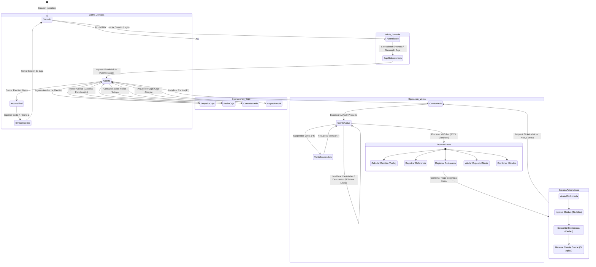

# Capacidad: Operación Diaria

> [!NOTE]
> Este documento depende de las especificaciones canónicas de los dominios del Core 1.0 de CajaFácil:
> - [Dominio de Ventas](file:///docs/business/dominios/09_DOMINIO_VENTAS.md) (CF-DOC-011)
> - [Dominio de Caja](file:///docs/business/dominios/10_DOMINIO_CAJA.md) (CF-DOC-010)
> - [Reglas de Negocio](file:///docs/business/06_REGLAS_DE_NEGOCIO.md) (CF-DOC-008)
> - [Dominio Clientes y Crédito](file:///docs/business/dominios/11_DOMINIO_CLIENTES_CREDITO.md)

---

## Introducción y Propósito

Este documento establece la especificación funcional oficial para la capacidad de **Operación Diaria** de CajaFácil. Su objetivo es diseñar e integrar el comportamiento conjunto de los dominios core (Empresa, Producto, Inventario, Caja, Ventas, Clientes y Crédito) durante una jornada operativa del negocio minorista. 

La capacidad de Operación Diaria describe detalladamente el flujo de trabajo completo del personal del punto de venta (POS) desde que se abren las cortinas del negocio hasta su arqueo y cierre físico nocturno. Esta especificación sirve de base absoluta y de guía inequívoca para los diseñadores de Experiencia de Usuario (UX), diseñadores de Interfaz de Usuario (UI), desarrolladores Frontend y equipos de Control de Calidad (QA).

---

## Objetivos de Rendimiento del Producto

Las siguientes métricas no representan limitantes exclusivamente de infraestructura técnica, sino **metas de diseño de producto** para garantizar que CajaFácil sea la herramienta POS más ágil y fluida del mercado.

| Evento de Operación | Meta de Producto (Límite Máximo) | Justificación de Negocio |
| :--- | :--- | :--- |
| **Inicio de Jornada (Login y Carga)** | < 3.0 segundos | El cajero no debe hacer esperar al primer cliente del día. |
| **Creación / Inicio de Sesión de Caja** | < 1.0 segundos | El proceso de validación e inserción de fondo inicial debe ser instantáneo. |
| **Apertura de Carrito Vacío** | < 0.2 segundos | Cero retardo perceptual al finalizar una venta y prepararse para la siguiente. |
| **Lectura de Código / Escaneo de Ítem** | < 0.1 segundos ($100\text{ ms}$) | El escaneo debe procesarse de manera inmediata en flujo continuo de mostrador. |
| **Búsqueda Autocompletable de Producto** | < 0.2 segundos ($200\text{ ms}$) | La búsqueda incremental por nombre no debe pausar la escritura. |
| **Suspensión de Venta (Hold)** | < 0.8 segundos | Guardar el carrito activo debe liberar la pantalla del POS de inmediato. |
| **Recuperación de Venta (Resume)** | < 1.5 segundos | Recuperar una venta suspendida de la lista debe tardar menos de 2 segundos. |
| **Confirmación de Pago y Envío a Impresora** | < 2.0 segundos | La confirmación del checkout físico debe imprimir el ticket inmediatamente para el cliente. |

---

## Diagrama de la Jornada Operativa Completa

El siguiente flujo representa la máquina de estados de la operación diaria del mostrador y su interacción con los distintos procesos transaccionales:



---

## Actores Involucrados

Para garantizar la seguridad transaccional, CajaFácil define los siguientes perfiles de usuario en el POS:

1. **Cajero (Operador Principal)**:
   - **Responsabilidad**: Registrar ventas, suspender/recuperar carritos, realizar cobros, realizar depósitos/retiros auxiliares de caja y consultar precios/existencias.
   - **Restricción**: No puede anular ventas confirmadas, otorgar descuentos mayores a la política general configurada ni realizar retiros de efectivo sin justificación/autorización.
2. **Supervisor (Validador)**:
   - **Responsabilidad**: Autorizar excepciones en el punto de venta (descuentos mayores, eliminación de líneas críticas en caliente, anulación de ventas confirmadas y realización de arqueos intermedios).
   - **Acceso**: Puede introducir su PIN/credencial directamente sobre la pantalla del cajero sin cerrar la sesión de este.
3. **Administrador**:
   - **Responsabilidad**: Configurar las políticas del motor de ventas, dar de alta productos, asignar usuarios/roles, definir límites de caja, configurar sucursales y ver reportes de rentabilidad.
4. **Cliente**:
   - **Consumidor Final (No Identificado)**: Por defecto en ventas al contado (`RN-404`). No requiere datos personales.
   - **Cliente Identificado**: Obligatorio para créditos (`RN-601`). Permite acumular puntos, recibir facturas nominativas y aplicar precios preferenciales.

---

## 1. Inicio de Jornada

El inicio de jornada garantiza que ningún cajero opere el sistema sin un flujo formal de responsabilidades financieras y trazabilidad de auditoría.

### Flujo de Operación Paso a Paso
1. **Autenticación (Login)**: El usuario introduce sus credenciales (o escanea su código de barras/tarjeta de empleado).
2. **Selección de Contexto**:
   - Si el usuario tiene acceso a múltiples Empresas, el sistema le obliga a seleccionar una (`RN-001`).
   - El sistema lista las Sucursales activas configuradas para la empresa elegida.
   - El sistema muestra las Cajas asignadas físicamente a esa Sucursal.
3. **Validación de Sesión Previa**:
   - **Verificación**: El sistema revisa si existe alguna `SesionCaja` abierta para la caja o el cajero seleccionado.
   - **Invariante**: Si la caja ya tiene una sesión abierta por otro cajero, el sistema bloquea el acceso e indica: *"La caja seleccionada está siendo operada por [Nombre del Cajero]. Debe cerrarse la sesión anterior antes de continuar"*.
4. **Declaración del Fondo Inicial**:
   - El cajero debe registrar obligatoriamente la cantidad de efectivo inicial presente en la gaveta física (caja chica).
   - **Regla**: El fondo inicial debe ser un número igual o mayor a cero.
5. **Apertura de Sesión**:
   - Al confirmar el fondo inicial, el sistema registra el evento `CajaAbierta`.
   - Se imprime automáticamente un comprobante físico de apertura en la ticketera para control de auditoría.
   - La caja pasa a estado `Abierta` en base de datos local y se habilita la pantalla de ventas.

---

## 2. Venta (Operación en Mostrador)

El mostrador es el núcleo de CajaFácil. Su diseño está optimizado para que la interacción sea intuitiva y extremadamente rápida.

```
+--------------------------------------------------------------------------------+
| CajaFácil POS - SUCURSAL NORTE  [Caja #1 - Abierta]  Usuario: Luis E. (Cajero) |
+--------------------------------------------------------------------------------+
| CLIENTE: Consumidor Final (F2)          | BUSCAR: [ 7501002341...           ]  |
+-----------------------------------------+--------------------------------------+
| DETALLE DE COMPRA (F1 para Nuevo)                                              |
| #  CÓDIGO      PRODUCTO                CANTIDAD    PRECIO      DESC     TOTAL  |
| 1  75010012    Leche Entera Sula 1L    2.00        L 32.00     L 0.00   L 64.00|
| 2  98124011    Pan Molde Bimbo 450g    1.00        L 48.00     L 2.00   L 46.00|
| 3  *BAL-032    Tomate Manzano (Granel) 1.250 kg    L 24.00/kg  L 0.00   L 30.00|
|                                                                                |
|                                                                                |
|                                                                                |
|                                                                                |
|                                                                                |
+--------------------------------------------------------------------------------+
| Líneas: 3 | Unidades: 4.25                  | SUBTOTAL:                L 140.00|
| [F6] Suspender | [F7] Recuperar             | IMPUESTO (15%):           L 21.00|
| [F8] Buscar P. | [F9] Descuento             | DESCUENTO:                L  2.00|
| [DEL] Borrar   | [ESC] Cancelar             | TOTAL A PAGAR:           L 159.00|
+--------------------------------------------------------------------------------+
| [F12] COBRAR / PAGAR --------------------------------------------------------- |
+--------------------------------------------------------------------------------+
```

### El Carrito y la Pantalla de Ventas
La pantalla de ventas mantiene un diseño limpio y enfocado. El foco del teclado está permanentemente en la barra de búsqueda o escaneo principal. 

### Escaneo y Búsqueda de Productos
- **Escaneo Continuo**: Cuando el cajero pasa un artículo por el lector, este emite el código y un retorno de carro (`Enter`). El sistema intercepta el código, busca el producto en la caché local y lo agrega directamente al carrito sin abrir ninguna ventana de confirmación.
- **Búsqueda Incremental**: Si el producto no tiene etiqueta, el cajero puede escribir las primeras letras del nombre. La lista se autocompleta inmediatamente abajo del campo de búsqueda. Al presionar `Enter` en el ítem seleccionado, se inserta al carrito.
- **Búsqueda Detallada (`F8`)**: Abre una ventana de búsqueda de productos avanzada con filtros por categoría y marcas, mostrando stock actual.

### Reglas de Control sobre Ítems en Carrito
1. **Productos Repetidos**:
   - *Decisión UX*: Si se escanea un producto que ya se encuentra en el carrito, el sistema no agrega una nueva línea independiente. En su lugar, incrementa la cantidad en la línea existente (`Cantidad = Cantidad + 1`).
   - *Justificación*: Mantiene el ticket compacto y facilita la lectura rápida para el cliente y el cajero.
2. **Productos por Peso (Decimales / Balanza)**:
   - *Comportamiento*: Al ingresar un código configurado como "Venta Decimal / Granel" (ej. Tomates), el sistema detiene el flujo continuo y enfoca el campo "Cantidad". El cajero puede escribir el peso (ej. `1.250`) o el sistema lo lee automáticamente si hay una balanza conectada al puerto serial.
3. **Productos Sin Código (Genéricos)**:
   - *Comportamiento*: Para artículos sin código o servicios rápidos, existe un botón o acceso rápido (`F4`) para agregar un "Producto Genérico". Se abre una pequeña ventana para ingresar el precio de forma manual y un nombre genérico (ej. "Bolsa de Hielo").
4. **Descuentos**:
   - **Descuento por Línea**: Permite aplicar un descuento (porcentaje o monto fijo) a un artículo específico.
   - **Descuento General**: Aplica un descuento sobre el total del carrito.
   - *Seguridad*: Si el descuento supera la política máxima de la empresa para cajeros (ej. > 5%), la pantalla solicita el PIN de autorización del Supervisor de forma inmediata.
5. **Eliminación de Líneas y Cancelación de Venta**:
   - **Eliminar Línea (`DEL`)**: Borra la línea activa seleccionada del carrito. Para evitar fraudes (cajeros que cobran y borran ítems sin que el cliente lo note), el sistema registra cada eliminación en el log de auditoría. Si está configurado el modo estricto, requiere autorización del supervisor.
   - **Cancelar Venta (`ESC`)**: Limpia el carrito por completo. Esta acción destructiva requiere siempre confirmación (`Y`/`N`) y guarda el registro del intento cancelado para auditoría de prevención de pérdidas.

---

## 3. Ventas Suspendidas (Hold / Resume)

En tiendas minoristas es muy frecuente que un cliente olvide su billetera o regrese al mostrador a buscar otro artículo, bloqueando la fila de pago. La suspensión de ventas resuelve este problema crítico.

### Reglas de Negocio
- **Límite de Ventas Suspendidas**: Se establece un límite máximo de **10 ventas suspendidas simultáneamente por cada caja registradora**.
  - *Justificación*: Evitar que la base de datos local y la memoria de la aplicación acumulen carritos obsoletos abandonados.
- **Sincronización**: Las ventas suspendidas pertenecen estrictamente a la sesión local de la terminal física. No se sincronizan en la nube.
- **Reserva de Stock**: **Una venta suspendida NO reserva existencias en el inventario**.
  - *Justificación*: Reservar stock por carritos suspendidos causaría sobreventa virtual en comercios de alto flujo. El stock se valida únicamente en el checkout final.

### Flujo Operativo de Suspensión
1. El cajero presiona `F6` mientras el carrito tiene productos.
2. El sistema guarda la sesión de venta en una tabla local temporal (SQLite) con la marca de tiempo y un identificador autogenerado (ej. *"Ticket Suspendido #01 (L 120.00)"*).
3. La pantalla del POS se limpia automáticamente y queda lista para atender al siguiente cliente en menos de 0.8 segundos.

### Flujo Operativo de Recuperación
1. El cajero presiona `F7`.
2. Se muestra un panel flotante o lateral con la lista de ventas suspendidas ordenada de forma cronológica (la más reciente primero).
3. El cajero selecciona el ticket mediante las flechas del teclado y presiona `Enter`.
4. El carrito se restaura exactamente como estaba antes de la suspensión, permitiendo seguir agregando productos o cobrar.

---

## 4. Checkout (Flujo de Cobro)

El checkout es el momento más crítico para minimizar el tiempo de espera del cliente. CajaFácil permite liquidar el importe del carrito mediante múltiples formas de pago.

```
+--------------------------------------------------------------------------------+
| CHECKOUT - CONFIRMACIÓN DE PAGO                                                |
+--------------------------------------------------------------------------------+
| TOTAL A COBRAR:                                                       L 159.00 |
+--------------------------------------------------------------------------------+
| MÉTODOS DE PAGO:                                                               |
|                                                                                |
| 1. EFECTIVO [F1] ------------------------------------------------------------- |
|    [ Recibido: [ L 200.00         ] ]  --> CAMBIO / VUELTO: L 41.00            |
|    Sugeridos: [ L 159.00 ]  [ L 200.00 ]  [ L 500.00 ]                         |
|                                                                                |
| 2. TARJETA [F2] -------------------------------------------------------------- |
|    Monto: [               ]  Referencia Transacción: [            ]            |
|                                                                                |
| 3. TRANSFERENCIA [F3] -------------------------------------------------------- |
|    Monto: [               ]  Referencia Banco: [                  ]            |
|                                                                                |
| 4. CRÉDITO [F4] -------------------------------------------------------------- |
|    Monto: [               ]  CLIENTE: [ Juan Pérez                      ]      |
|    Saldo Disponible: L 1,500.00                                                |
+--------------------------------------------------------------------------------+
| COBERTURA DEL PAGO: 100% (L 159.00 de L 159.00)                                |
+--------------------------------------------------------------------------------+
| [Enter] Confirmar e Imprimir Factura                                           |
+--------------------------------------------------------------------------------+
```

### Canales de Pago Disponibles
- **Efectivo**: El método más veloz. El sistema muestra botones inteligentes con montos sugeridos (ej. el importe exacto, el billete superior inmediato como L 200 o L 500). Al ingresar el monto recibido, el sistema calcula de forma gigante el **Cambio (Vuelto)** en pantalla.
- **Tarjeta**: Para registrar transacciones hechas en datáfonos independientes. El cajero introduce el monto cobrado y la referencia numérica del voucher emitido por el datáfono.
- **Transferencia**: Permite registrar pagos vía transferencias bancarias directas, billeteras electrónicas o códigos QR. Requiere registrar la referencia bancaria para conciliación.
- **Crédito**: Pago mediante cuenta de crédito interna.
  - **Invariante**: Obliga a que el cliente esté plenamente identificado en el POS (`RN-601`). El sistema valida que el saldo disponible del cliente sea mayor o igual al monto de crédito solicitado.
- **Pago Mixto (Combinado)**: Permite pagar con múltiples métodos en la misma venta (ej. L 100 en efectivo y L 59 con tarjeta). El checkout permanece abierto y no permite la confirmación final hasta que la suma de los montos ingresados cubra exactamente el 100% del total del ticket.

### Confirmación Final
Al presionar `Enter` con el cobro completado, se dispara el proceso de persistencia atómica y emisión física del ticket.

---

## 5. Eventos y Acciones Automáticas Post-Venta

Una vez confirmada la venta en el mostrador, ocurren una serie de integraciones lógicas que aseguran que el ERP/SaaS esté al día. Esto se procesa de forma atómica a través de eventos de dominio de la siguiente manera:

```
                  +--------------------------------+
                  |  Pago Confirmado en Checkout  |
                  +--------------------------------+
                                  |
                                  v
                    [Evento: VentaConfirmada]
                                  |
         +------------------------+------------------------+
         |                        |                        |
         v                        v                        v
+------------------+     +------------------+     +------------------+
|   Dominio CAJA   |     |Dominio INVENTARIO|     | Dominio CRÉDITO  |
+------------------+     +------------------+     +------------------+
| Registra         |     | Genera           |     | Registra         |
| MovimientoCaja   |     | MovimientoStock  |     | Deuda y saldo   |
| (Ingreso         |     | (Salida física   |     | en la cuenta     |
|  efectivo/tarj)  |     |  de inventario)  |     | del cliente      |
+------------------+     +------------------+     +------------------+
         |                        |                        |
         +------------------------+------------------------+
                                  |
                                  v
                   [Generación de Comprobante]
                                  |
                                  v
                  +--------------------------------+
                  |   Envío a Spooler de Impresión |
                  +--------------------------------+
```

1. **Registrar Venta**: Se persiste el agregado `Venta` con estado `Confirmada` junto a sus detalles y formas de pago aceptadas.
2. **Registrar Movimiento en Caja**: El dominio Caja recibe la notificación e inserta un `MovimientoCaja` de tipo "Ingreso por Venta" por los importes en efectivo, tarjeta o transferencia recibidos.
3. **Registrar Movimiento de Inventario**: El dominio Inventario inserta un `MovimientoInventario` de salida de tipo "Venta" para cada artículo vendido, actualizando la caché de existencias (`ExistenciaProducto`).
4. **Registrar Deuda**: Si se utilizó el método de pago Crédito, el dominio Crédito registra un movimiento de `Deuda` para el Cliente, aumentando su saldo adeudado y reduciendo su cupo disponible.
5. **Comprobante de Venta**: Se envía la factura formateada al motor de impresión local para salida física térmica.

---

## 6. Operaciones Auxiliares de Caja

El control de la gaveta física requiere que los flujos monetarios no relacionados con ventas directas sean registrados de manera formal (`RN-501`).

### A) Depósitos (Ingreso de Efectivo)
- **Caso de Uso**: El administrador inyecta dinero a la caja para cambio (vencimiento de billetes grandes) o por un préstamo transitorio.
- **Flujo**: El cajero registra el monto y selecciona la categoría (ej. *"Ingreso para Cambio"*). Genera un `MovimientoCaja` tipo ingreso.

### B) Retiros (Salida de Efectivo)
- **Caso de Uso**: Retiros de efectivo para pago a proveedores express (ej. repartidor de refrescos), pago de servicios locales o arqueos de recolección de efectivo por seguridad ante montos acumulados altos.
- **Flujo**: El cajero registra el monto y la justificación. Requiere la autorización (PIN) del Supervisor si supera la política de montos máximos libres del cajero. Genera un `MovimientoCaja` tipo egreso.

### C) Consulta de Saldo Teórico
- **Comportamiento**: Muestra en pantalla o imprime el dinero que el sistema calcula que debería haber en la gaveta en base a la suma algebraica de:
  $$\text{Saldo de Caja} = \text{Fondo Inicial} + \text{Ingresos Ventas Efectivo} + \text{Depósitos Auxiliares} - \text{Retiros Auxiliares}$$
  *Regla UX*: Se accede mediante atajo rápido y se puede ocultar para evitar miradas no autorizadas de clientes.

### D) Arqueo de Caja (Corte X)
- **Definición**: Auditoría física e intermedia donde el supervisor cuenta el efectivo de la gaveta sin cerrar la sesión de caja del cajero.
- **Flujo**: El supervisor cuenta las monedas y billetes, introduce el monto físico y el sistema calcula la discrepancia:
  $$\text{Discrepancia} = \text{Efectivo Físico} - \text{Saldo Teórico de Efectivo}$$
  El sistema guarda el arqueo y si hay un faltante o sobrante, se registra un log de auditoría inmutable.

### E) Cierre de Caja (Corte Z)
- **Definición**: El proceso obligatorio y formal de cierre al terminar la jornada (`RN-503`).
- **Flujo**:
  1. El cajero selecciona "Cerrar Caja" (`F11`).
  2. El sistema obliga a ingresar el recuento físico de efectivo en gaveta.
  3. El sistema calcula el saldo final teórico de todas las formas de pago (Efectivo, Tarjeta, Transferencias, Crédito).
  4. Genera el **Corte Z** detallando: Ventas totales, impuestos cobrados, anulaciones, egresos y la discrepancia del cierre.
  5. Imprime el reporte oficial de cierre, bloquea la terminal de ventas para ese cajero y cambia el estado de la sesión de caja a `Cerrada`.
  6. Envía el paquete de transacciones a la nube para consolidación administrativa (SaaS).

---

## 7. Consultas Rápidas (En Caliente)

Para que el cajero no pierda la venta activa al responder preguntas del cliente, CajaFácil implementa consultas superpuestas no destructivas.

- **Consulta de Precios y Existencias (`F3`)**:
  - *Comportamiento*: Al presionar `F3`, se despliega un panel lateral flotante sobre la venta en curso. El cajero puede escanear un código de barras o escribir un nombre. El panel muestra la imagen del producto, precio público, impuestos aplicables y la existencia física en tiempo real en la tienda actual y en sucursales vecinas.
  - *Cierre*: Al presionar `ESC`, el panel se cierra y el cursor regresa exactamente a la línea del carrito en la que estaba trabajando, sin alterar los productos cargados.
- **Búsqueda de Clientes y Estado de Crédito (`F2` -> Buscar)**:
  - Permite verificar el cupo actual, facturas vencidas y datos generales del cliente antes de comenzar el checkout.
- **Historial de Últimas Ventas**:
  - Despliega una lista con las últimas 10 facturas emitidas en la terminal actual, permitiendo la reimpresión rápida de tickets por reclamos del cliente sin salir del carrito activo.

---

## 8. Manejo de Errores y Resiliencia Offline

Como sistema **Offline-First**, CajaFácil debe garantizar la resiliencia física de la terminal de ventas en situaciones de falla comunes en el comercio minorista latinoamericano.

### Comportamiento del POS ante Contingencias

```
+--------------------------+-----------------------------------------------------------+
| Falla / Contingencia     | Comportamiento y Acción del POS (CajaFácil)               |
+--------------------------+-----------------------------------------------------------+
| Corte de Internet / Red  | - La venta NO se detiene. El POS almacena las facturas    |
|                          |   en la base de datos local SQLite embedded.              |
|                          | - Un indicador en pantalla muestra: "Modo Offline Activo". |
|                          | - Los eventos de dominio se encolan localmente.          |
|                          | - Al volver la red, el motor sincroniza en segundo plano. |
+--------------------------+-----------------------------------------------------------+
| Impresora de Tickets     | - El POS muestra un mensaje de alerta: "Impresora fuera   |
| Desconectada / Sin papel |   de línea".                                              |
|                          | - El sistema encola el documento de impresión en el       |
|                          |   Spooler local.                                          |
|                          | - Ofrece un botón visible de "Reintentar Impresión"       |
|                          |   o "Exportar a PDF / Enviar por Email".                  |
+--------------------------+-----------------------------------------------------------+
| Lector de Barras Dañado  | - El cajero puede cambiar al modo teclado usando `F8`     |
|                          |   para búsqueda por nombre o ingresar el código de        |
|                          |   barras manualmente en el buscador principal.            |
+--------------------------+-----------------------------------------------------------+
| Intento de Venta con     | - Si el producto tiene `controls_stock = True` y          |
| Stock Insuficiente       |   `allows_negative = False`, el sistema emite una alerta  |
|                          |   y bloquea el agregado del ítem al carrito.              |
|                          | - Si `allows_negative = True`, permite agregarlo y        |
|                          |   registra la existencia negativa provisional.            |
+--------------------------+-----------------------------------------------------------+
| Abandono o Pago          | - Si el cliente desiste o su tarjeta es rechazada en el   |
| Incompleto               |   checkout, la venta permanece en la pantalla de cobro    |
|                          |   permitiendo cambiar el medio de pago o cancelar.        |
+--------------------------+-----------------------------------------------------------+
| Intento de Venta en      | - El sistema bloquea de raíz el checkout si no existe una  |
| Caja Cerrada             |   sesión de caja activa y abierta para el cajero.         |
+--------------------------+-----------------------------------------------------------+
```

---

## 9. Reglas y Directrices de Experiencia de Usuario (UX)

Para garantizar la velocidad en mostrador, CajaFácil impone reglas estrictas sobre el diseño de la interfaz:

### A) Navegación y Control por Teclado Obligatorios
El cajero no debe retirar las manos del teclado para operar el POS. El uso del mouse es considerado un fallo de velocidad de diseño.

#### Matriz Oficial de Atajos del Teclado (Hotkeys)
- `F1`: Inicializar Carrito Nuevo / Nueva Venta (Limpia la pantalla tras una venta confirmada).
- `F2`: Enfocar selector de Cliente (Consumidor Final por defecto).
- `F3`: Abrir / Cerrar Panel Lateral de Consulta Rápida (Precios / Existencias).
- `F4`: Agregar Producto Genérico (Permite fijar precio manual al vuelo).
- `F5`: Cambiar Cantidad de la línea seleccionada en el carrito.
- `F6`: Suspender Carrito Activo (Hold).
- `F7`: Ver lista de Ventas Suspendidas para recuperar (Resume).
- `F8`: Abrir Buscador Avanzado de Productos (Grid catálogo).
- `F9`: Aplicar Descuento a la línea seleccionada o al total.
- `F11`: Abrir Panel de Operaciones Auxiliares y Cierre de Caja.
- `F12` o `+` (Teclado Numérico): Ir a Checkout (Pagar).
- `ESC`: Cancelar Operación en curso / Limpiar carrito activo.
- `DEL` (Suprimir): Borrar línea seleccionada en el carrito.
- `Flechas Arriba / Abajo`: Navegar entre las líneas del carrito de ventas.

### B) Escaneo Continuo Transparente
La interfaz debe ser ciega al foco para el escaneo de códigos de barra. Sin importar qué botón o menú esté seleccionado de forma secundaria, si se detecta una entrada de caracteres rápidos con terminación de Enter del escáner, se interpreta como código de producto y se inserta automáticamente al carrito.

### C) Eliminación de Popups e Interrupciones
- **Prohibición**: Quedan prohibidos los popups de alerta que requieran hacer clic en "Aceptar" para confirmar acciones normales.
- **Alternativa**: Utilizar notificaciones tipo "Toast" auto-desvanecibles en las esquinas de la pantalla para confirmar acciones exitosas (ej. *"Producto agregado"*).
- **Confirmación única**: Solo se solicitará confirmación modal para acciones destructivas del flujo (cancelar una venta en curso o cerrar el turno de caja).

---

## 10. Lo que CajaFácil NO hará (Anti-patrones de Diseño)

Para mantener la filosofía del producto intacta, el POS de CajaFácil evitará expresamente las siguientes prácticas:

- **No dependerá del mouse**: La interfaz gráfica no tendrá botones obligatorios que carezcan de un atajo de teclado directo.
- **No bloqueará ventas por fallas de conexión**: El sistema no consultará servicios web en la nube en el flujo crítico del checkout. Todo se valida localmente y se encola.
- **No solicitará información fiscal del cliente para compras de contado de bajo valor**: Se asume Consumidor Final de forma automática sin ventanas emergentes de "Ingrese Datos de Facturación".
- **No obligará a cerrar el carrito activo para consultar stock**: La consulta lateral `F3` debe convivir visualmente con la venta activa.
- **No modificará stock físico de forma directa en el POS**: El POS solo genera movimientos de inventario (`RN-201`), nunca asigna cantidades fijas a la base de datos de manera arbitraria.
- **No ocultará los impuestos en el ticket intermedio**: El desglose tributario calculado por el motor de impuestos debe mostrarse claramente en tiempo real en la pantalla y no solo al imprimir.

---

## 11. Configuración por Tipo de Negocio (Matriz de Variabilidad)

CajaFácil es un único producto de software que se adapta a diferentes tipos de comercio minorista a través de perfiles de configuración iniciales, sin alterar el Core 1.0.

### Matriz Comparativa de Ajustes por Perfil

| Característica Funcional | Pulpería / Abasto | Minisúper / Conveniencia | Farmacia | Ferretería |
| :--- | :--- | :--- | :--- | :--- |
| **Venta sin Existencias (Stock Negativo)** | **Permitido** (El dueño prefiere vender y ajustar después). | **Restringido** (Se requiere control rígido de góndolas). | **Bloqueado** (Crítico para control de lotes médicos). | **Permitido** (Materiales de patio/construcción). |
| **Integración con Báscula Serial / Balanza** | No (Pesajes manuales informales). | Opcional (Pesaje de frutas/verduras). | No aplicable. | Opcional (Pesaje de clavos/tornillos). |
| **Control de Caducidades y Lotes** | No. | Opcional (Perecederos). | **Obligatorio** (Venta prohibida de vencidos). | No. |
| **Buscador Visual de Favoritos (Grid)** | Sí (Acceso a hielo, pan fresco, golosinas rápidas). | Opcional. | No (Todo por código/nombre científico). | Opcional. |
| **Ventas Suspendidas Activas** | Poco frecuente. | Muy frecuente (Filas largas de checkout). | Frecuente (Espera de recetas médicas). | Frecuente (El cliente va al patio a traer material). |
| **Manejo de Crédito a Clientes** | Muy frecuente (El tradicional "Fiao" en libreta). | Poco frecuente (Suele ser 100% contado). | Opcional. | Muy frecuente (Cuentas corrientes de contratistas). |

### Cómo Mantener un Único Motor Configurable
El backend y el frontend leen al iniciar un Objeto de Configuración del Tenant (`CompanySettings`) que habilita o deshabilita los flags correspondientes:
- `allows_negative_stock`: Booleano global que intercepta las validaciones de stock.
- `requires_lot_validation`: Fuerza al checkout a solicitar lote y fecha de vencimiento.
- `has_scale_integration`: Activa los drivers de comunicación de hardware local para básculas.
- `max_discount_cajero`: Porcentaje límite que activa la solicitud de PIN de supervisor en UI.
- `enable_customer_credit`: Activa la opción de cobro por crédito en el mostrador.

Esta arquitectura parametrizada asegura que no existan bifurcaciones de código fuente (forks) para cada tipo de comercio, garantizando un mantenimiento unificado del POS de CajaFácil.
