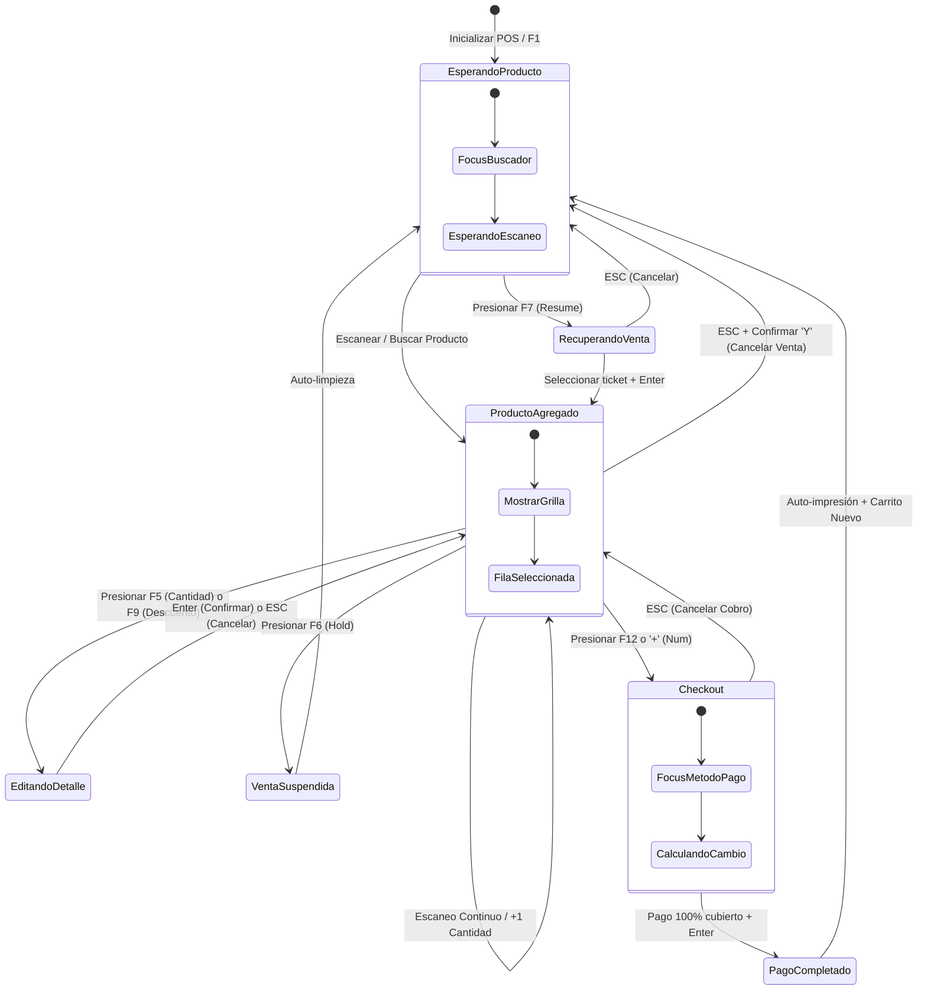
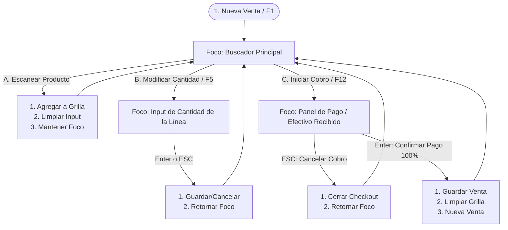
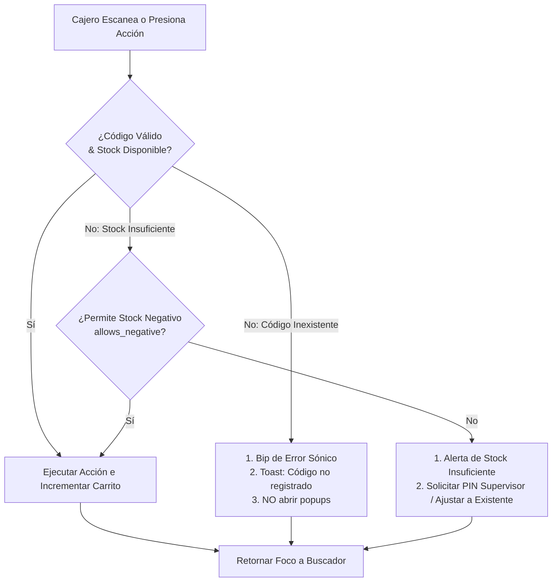

# Arquitectura UX del POS de CajaFácil

> [!NOTE]
> Este documento depende de las especificaciones de negocio de la capacidad de Operación Diaria y el Design System:
> - [Capacidad: Operación Diaria](file:///docs/business/55_ANALISIS_FUNCIONAL_OPERACION_DIARIA.md) (CF-DOC-055)
> - [Design System Oficial](file:///docs/business/56_DESIGN_SYSTEM.md) (CF-DOC-056)
> - [Dominio de Ventas](file:///docs/business/dominios/09_DOMINIO_VENTAS.md) (CF-DOC-011)

---

## 1. Filosofía de Interacción

La arquitectura de interacción de CajaFácil está diseñada para que la interfaz se comporte de manera predecible, ágil y subordinada a la velocidad física de mostrador del cajero. Esta filosofía se rige por cinco pilares fundamentales:

### A) El cajero nunca pierde el foco (Foco Persistente)
- **Descripción**: La entrada principal de datos (barra de escaneo) nunca debe perder el foco de escritura activo de forma involuntaria. Cualquier interacción secundaria (agregar un ítem, borrar una línea, ver precios) debe retornar automáticamente el foco al punto de venta principal al finalizar.
- **Justificación**: Si el foco se pierde y el cajero escanea un producto, el lector enviará caracteres inertes al sistema que no se registrarán, obligando a re-escanear y retrasando la fila.

### B) El teclado tiene prioridad absoluta (Keyboard-First)
- **Descripción**: La navegación, selección, edición y confirmación de transacciones se realizan mediante atajos físicos de teclado. El mouse queda relegado a funciones administrativas o de configuración.
- **Justificación**: La manipulación física del mouse introduce una latencia física del operador de más de $1.2\text{ segundos}$ por interacción. El uso del teclado numérico y las teclas de función reduce este tiempo a milisegundos por memoria muscular.

### C) El escáner es la entrada principal síncrona
- **Descripción**: El flujo principal está diseñado para que el paso del producto por el escáner sea interpretado de forma transparente e inmediata, agregando una unidad del producto directamente al carrito de compras sin requerir interacción adicional del cajero.
- **Justificación**: Acelera el mostrador en un 80% en comparación con la selección manual mediante menús en pantalla.

### D) La interfaz responde inmediatamente
- **Descripción**: La retroalimentación de cada acción en pantalla debe ocurrir de forma instantánea ($<100\text{ ms}$). Las consultas a base de datos local y proyecciones de stock deben ser inmediatas, y las tareas pesadas (sincronización con la nube) deben delegarse a hilos de segundo plano de forma no bloqueante.
- **Justificación**: El cerebro humano detecta bloqueos de interfaz a partir de los $100\text{ ms}$. Una interfaz reactiva disminuye la ansiedad del operador.

### E) Nunca bloquear la operación sin una razón crítica
- **Descripción**: El sistema debe tolerar fallas de red, impresoras sin papel y lecturas erróneas de códigos permitiendo seguir registrando el carrito de la venta en curso. Solo se bloqueará la operación si ocurre una violación de invariante de negocio crítica (ej. intentar cobrar con crédito a Consumidor Final).
- **Justificación**: Un POS bloqueado detiene físicamente el mostrador y cancela la venta en progreso. La tolerancia a fallos mantiene la fluidez comercial.

---

## 2. Modos del POS

El POS de CajaFácil opera bajo cinco modos de interacción específicos. Cada modo tiene responsabilidades claras y restringe las acciones para evitar errores operativos:

```
+----------------------------------------------------------------------------------------------------+
| MODOS DE INTERACCIÓN DEL POS                                                                       |
+----------------------------------------------------------------------------------------------------+
| 1. MODO VENTA         | Escaneo continuo de ítems, edición de cantidades y gestión de carrito.       |
| 2. MODO COBRO         | Selección de métodos de pago (Efectivo, Tarjeta, Crédito, etc.) y checkout.  |
| 3. MODO CONSULTA      | Vista flotante de precios y existencias de productos sin alterar venta.    |
| 4. MODO SUPERVISOR    | Autorización de excepciones mediante PIN (descuentos altos, anulaciones).  |
| 5. MODO RECUPERACIÓN  | Visualización y reanudación de ventas locales previamente suspendidas.     |
+----------------------------------------------------------------------------------------------------+
```

### 1. Modo Venta (Default)
- **Responsabilidad**: Escaneo continuo de productos, búsqueda rápida por nombre, modificación de cantidades de líneas y eliminación de artículos del carrito.
- **Restricciones**: No permite ingresar flujos de cobro parciales ni realizar arqueos de caja sin salir formalmente del carrito.

### 2. Modo Cobro (Checkout)
- **Responsabilidad**: Selección de canales de pago (Efectivo, Tarjeta, Transferencia, Crédito o Combinado), cálculo de cambio (vuelto) y confirmación final de facturación.
- **Restricciones**: El carrito se bloquea y entra en estado de lectura (no se pueden agregar nuevos productos, cambiar cantidades ni modificar descuentos desde la pantalla de cobro). Se debe salir del checkout (`ESC`) para modificar el carrito.

### 3. Modo Consulta
- **Responsabilidad**: Permitir al cajero escanear o buscar cualquier producto para indicarle el precio o existencia al cliente.
- **Restricciones**: Coexiste visualmente de forma superpuesta (panel lateral `F3`). No altera el carrito activo. El teclado numérico y el escáner se redirigen temporalmente al visor de consulta.

### 4. Modo Supervisor (Verificación PIN)
- **Responsabilidad**: Validar credenciales de seguridad en pantalla para autorizaciones críticas (anulaciones de tickets, descuentos mayores a la política del cajero).
- **Restricciones**: Suspende temporalmente el flujo interactivo del cajero mediante un overlay de bloqueo de foco. Al ingresar el PIN correcto, retorna el control al cajero aplicando el cambio autorizado.

### 5. Modo Recuperación
- **Responsabilidad**: Mostrar la cola local de tickets suspendidos en espera.
- **Restricciones**: Al seleccionar un ticket, éste se remueve de la cola y se carga en el carrito activo. Si el carrito actual no está vacío, el sistema obliga a suspender la venta actual o a cancelarla antes de cargar la recuperada.

---

## 3. Máquina de Estados de Interacción del POS

El comportamiento del POS se rige por la siguiente máquina de estados formal. Se definen las condiciones de entrada, las acciones permitidas y la salida de cada estado:

### Estado A: Esperando Producto (Carrito Vacío)
- **Cómo se entra**: Al abrir el turno de caja, tras confirmar e imprimir una venta exitosa, o al presionar `F1` (Nueva Venta).
- **Acciones permitidas**: Escanear código de barras, escribir nombre en el buscador principal, presionar `F2` para asociar cliente, abrir panel lateral de consulta (`F3`), abrir menú auxiliar de caja (`F11`), abrir lista de suspendidas (`F7`).
- **Cómo se sale**: Al registrar con éxito el primer producto en el carrito (transición a *Estado B: Producto Agregado*).

### Estado B: Producto Agregado (Carrito Activo)
- **Cómo se entra**: Al registrar el primer producto o al recuperar un ticket suspendido de la cola.
- **Acciones permitidas**: Continuar escaneando productos (flujo continuo), modificar cantidad de línea seleccionada (`F5`), eliminar línea (`DEL`), aplicar descuento (`F9`), suspender venta (`F6`), cancelar carrito completo (`ESC`), proceder a cobrar (`F12` / `+`).
- **Cómo se sale**:
  - Al presionar `F12` / `+` (transición a *Estado E: Checkout*).
  - Al presionar `F6` (transición a *Estado D: Venta Suspendida*).
  - Al presionar `ESC` y confirmar (transición a *Estado A: Esperando Producto*).

### Estado C: Editando Detalle (F5 / F9 activado)
- **Cómo se entra**: El cajero selecciona una línea del carrito y presiona `F5` (Cantidad) o `F9` (Descuento).
- **Acciones permitidas**: Digitar un valor numérico en el input enfocado, presionar `Enter` para confirmar, o `ESC` para abortar el cambio.
- **Cómo se sale**: Al presionar `Enter` o `ESC` (retorna de inmediato al *Estado B: Producto Agregado*).

### Estado D: Venta Suspendida (Hold)
- **Cómo se entra**: Desde *Estado B* presionado `F6` (siempre que el carrito tenga al menos 1 producto).
- **Acciones permitidas**: El sistema guarda localmente el carrito en SQLite y limpia la grilla visual.
- **Cómo se sale**: Transición automática inmediata a *Estado A: Esperando Producto* tras liberar la memoria del mostrador.

### Estado E: Checkout (Cobro Activo)
- **Cómo se entra**: Desde *Estado B* presionado `F12` o la tecla `+` del teclado numérico.
- **Acciones permitidas**: Seleccionar método de pago (`F1`-`F4`), ingresar montos recibidos, asociar referencias de transferencias o tarjetas, y presionar `Enter` al cubrir el 100% del total.
- **Cómo se sale**:
  - Al confirmar la venta con el pago completo (transición a *Estado F: Pago Completado*).
  - Al presionar `ESC` (cancela el flujo de cobro y retorna al *Estado B* con el carrito intacto).

### Estado F: Pago Completado
- **Cómo se entra**: Desde *Estado E* al presionar `Enter` habiendo cubierto el 100% de la venta.
- **Acciones permitidas**: El sistema persiste la venta, despacha los eventos de dominio locales de caja e inventario, y envía la orden al spooler de impresión.
- **Cómo se sale**: Transición automática inmediata al *Estado A: Esperando Producto* (inicializando un nuevo carrito vacío).

### Estado G: Alerta de Error Recuperable
- **Cómo se entra**: En cualquier momento ante fallas de hardware (impresora), stock insuficiente o datos de pago inválidos.
- **Acciones permitidas**: Leer el mensaje de advertencia y presionar `ESC` o `Enter` para descartar la notificación flotante (toast).
- **Cómo se sale**: Al descartar la alerta, regresa exactamente al estado previo a la interrupción.

---

## 4. Flujo de Foco del Teclado (Keyboard Focus Flow)

El foco de entrada del teclado es el activo más valioso de la velocidad operativa. Se establecen reglas estrictas sobre dónde debe estar situado el foco en todo momento:

```
+----------------------------------------------------------------------------------------------------+
| REGLAS DE FLUJO DE FOCO DEL TECLADO                                                                |
+----------------------------------------------------------------------------------------------------+
| 1. Inicio de venta / Limpieza  --> Enfocar automáticamente Buscador Principal.                    |
| 2. Escaneo de producto         --> Agregar al carrito e INMEDIATAMENTE re-enfocar Buscador.       |
| 3. Edición de cantidad (F5)    --> Mover foco al input de cantidad inline; al guardar re-enfocar.  |
| 4. Cancelación de cobro (ESC)  --> Regresar del checkout al carrito y enfocar Buscador.            |
| 5. Cierre de alerta / modal    --> Cerrar popup y retornar el foco al Buscador de venta.           |
+----------------------------------------------------------------------------------------------------+
```

### A) Al iniciar una venta o tras limpiar pantalla
El foco debe situarse de forma automática e inmediata en el campo de texto del **Buscador Principal** (barra de búsqueda/escaneo). El cajero no debe hacer clic en la pantalla al iniciar el día o tras finalizar un ticket.

### B) Después de escanear o buscar un producto
Al presionar `Enter` o recibir la entrada del lector de códigos de barras, el producto se agrega a la grilla y el foco de texto **regresa inmediatamente al Buscador Principal**, limpiando el texto anterior. El cajero puede escanear de forma ininterrumpida sin pausas.

### C) Al editar cantidad (`F5`) o descuento (`F9`)
El foco se traslada temporalmente del Buscador Principal al campo de entrada numérico específico de la línea del carrito seleccionada. Al presionar `Enter` (para confirmar) o `ESC` (para cancelar), el valor se procesa y el foco **retorna de inmediato al Buscador Principal**.

### D) Después de borrar una línea (`DEL`)
El ítem se elimina de la grilla del carrito, el cursor de selección visual de la tabla se posiciona en el ítem inmediatamente superior, y el foco de entrada del teclado **se mantiene o retorna al Buscador Principal**.

### E) Al ingresar al Checkout (`F12` / `+`)
El foco se traslada al panel de cobro, seleccionando por defecto el campo de "Efectivo Recibido". Al presionar `ESC` para abortar el cobro, el panel de checkout se cierra y el foco **regresa al Buscador Principal**.

### F) Después de cerrar una alerta o modal de error
Al presionar `ESC` o `Enter` sobre un toast o modal de alerta, la ventana se cierra y el foco **retorna al Buscador Principal** del POS.

---

## 5. Matriz de Eventos del POS

La siguiente matriz documenta las transiciones del sistema ante las acciones del cajero:

| Estado Inicial | Acción del Usuario | Resultado Esperado | Estado Final |
| :--- | :--- | :--- | :--- |
| **Esperando Producto** | Escanea código de barras | Agrega producto a la grilla con cantidad = 1. Retorna foco a buscador. | **Producto Agregado** |
| **Esperando Producto** | Escribe nombre de producto | Muestra sugerencias dinámicas en cascada abajo del input. | **Esperando Producto** |
| **Producto Agregado** | Escanea producto nuevo | Inserta nueva línea al final del carrito. Retorna foco a buscador. | **Producto Agregado** |
| **Producto Agregado** | Escanea producto existente | Incrementa cantidad de la línea existente en +1. Foco en buscador. | **Producto Agregado** |
| **Producto Agregado** | Presiona `F5` (Cantidad) | Enfoca campo numérico de la fila seleccionada y autoselecciona el texto.| **Editando Detalle** |
| **Editando Detalle** | Digita número y `Enter` | Actualiza la cantidad de la línea y recalcula subtotales y totales. | **Producto Agregado** |
| **Producto Agregado** | Presiona `DEL` (Borrar) | Elimina la fila de la grilla, recalcula totales y registra en log de auditoría.| **Producto Agregado** |
| **Producto Agregado** | Presiona `F6` (Suspender) | Guarda carrito en SQLite local con marca temporal. Limpia pantalla. | **Esperando Producto** |
| **Esperando Producto** | Presiona `F7` (Ver Suspendidas)| Despliega lista de ventas en espera ordenadas cronológicamente. | **Modo Recuperación**|
| **Modo Recuperación** | Elige ticket y presiona `Enter`| Remueve de lista local, carga ítems en el carrito del POS. Foco a buscador. | **Producto Agregado** |
| **Producto Agregado** | Presiona `F12` o `+` (Cobrar) | Abre panel de Checkout, bloquea edición del carrito. Foco en Efectivo. | **Checkout** |
| **Checkout** | Presiona `ESC` (Cancelar cobro) | Cierra panel de cobro, libera edición de carrito. Foco a buscador. | **Producto Agregado** |
| **Checkout** | Completa pago y presiona `Enter`| Guarda venta, emite eventos locales, envía a ticketera y limpia grilla. | **Pago Completado** |
| **Pago Completado** | Inicialización automática | Genera nuevo folio de venta en blanco. Foco en buscador. | **Esperando Producto** |
| **Producto Agregado** | Presiona `ESC` (Cancelar venta) | Muestra modal de confirmación *"¿Limpiar venta activa? (Y/N)"*. | **Alerta de Confirmación**|
| **Alerta Confirmación**| Presiona `Y` (Confirmar) | Limpia el carrito por completo. Foco al buscador de venta. | **Esperando Producto** |

---

## 6. Prioridad de Eventos y Resolución de Conflictos

En la operación del mostrador, es probable que ocurran múltiples eventos del sistema y del usuario casi de forma simultánea. Para evitar bloqueos o comportamientos inconsistentes, se establece la siguiente escala de prioridades:

$$\text{Prioridad 1 (Crítica): Entradas de Escáner (Lector de Códigos)}$$
$$\text{Prioridad 2: Comandos de Teclas Rápidas (Hotkeys: F1-F12, ESC, DEL)}$$
$$\text{Prioridad 3: Respuestas de Hardware Local (Básculas, Voucher Datáfono)}$$
$$\text{Prioridad 4: Notificaciones en Segundo Plano (Sincronización, Estado de Red)}$$

### Reglas de Resolución de Conflictos
1. **Escaneo durante la Edición Numérica**: Si el cajero está editando la cantidad de un ítem en caliente (foco en input de línea) y se detecta una entrada limpia del lector de códigos de barras (escáner), el POS **completa automáticamente** la edición numérica con el valor digitado, sale del modo de edición, procesa el escaneo del nuevo ítem y retorna el foco a la barra de búsqueda principal.
   *Justificación*: Evita que el código de barras escaneado se escriba por error dentro del campo de cantidad del producto anterior.
2. **Llegada de Alerta de Red durante Checkout**: Si el sistema detecta que se perdió la conexión a internet mientras el cajero está digitando el pago en efectivo, la notificación de "Modo Offline Activo" se muestra de forma pasiva en la barra superior (badge) y como una alerta Toast silenciosa que **no roba el foco** de la pantalla de cobro.
   *Justificación*: Las alertas informativas no deben interrumpir el checkout transaccional activo del cajero.

---

## 7. Eventos Bloqueantes y No Bloqueantes

Para evitar retardos perceptuales en el POS, las tareas del sistema se dividen según su impacto interactivo:

### A) Eventos Síncronos Bloqueantes (Freno del POS)
- **Definición**: Acciones que detienen la pantalla para garantizar la consistencia matemática o la seguridad de la operación.
- **Acciones**:
  - Espera de confirmación del PIN de supervisor para aplicar un descuento mayor al límite.
  - Validación física de saldo disponible antes de confirmar un cobro por la vía de Crédito.
  - Modal de confirmación al presionar cancelar venta activa (`ESC`).

### B) Eventos Asíncronos No Bloqueantes (Procesamiento en background)
- **Definición**: Tareas que ocurren en segundo plano. El cajero puede seguir vendiendo mientras estas tareas se ejecutan.
- **Acciones**:
  - **Sincronización con la Nube**: El envío de facturas confirmadas y logs a los servidores centrales SaaS se encola y procesa en background.
  - **Spooler de Impresión**: El renderizado del ticket térmico y la comunicación USB/Red con la ticketera se realiza de forma asíncrona. La pantalla principal se limpia de inmediato para la siguiente venta.
  - **Consulta de existencias en sucursales vecinas**: Al abrir el visor lateral (`F3`), el POS busca en base de datos local y, si hay red, hace la petición remota en background, actualizando la pantalla solo cuando recibe el dato sin congelar la interfaz.

---

## 8. Manejo de Interrupciones en el Flujo

El POS de CajaFácil debe ser resiliene ante fallas comunes del negocio minorista sin forzar la pérdida de los productos que ya están en el carrito de compras.

### A) Producto Inexistente al Escanear
- **Comportamiento del POS**: Al escanear un código no registrado en el catálogo local, el POS emite un sonido distintivo de error (Bip corto grave) y muestra un banner flotante auto-desvanecible (Toast) indicando: *"Código no registrado: [Código]"*.
- **Preservación del Flujo**: El foco de texto **permanece en el Buscador Principal** y el carrito de compras no se altera. El cajero puede seguir escaneando otros productos inmediatamente. No se abre ningún popup interactivo de alerta que obligue a presionar "Aceptar".

### B) Stock Insuficiente en Venta Decimal
- **Comportamiento del POS**: Si el cajero ingresa un peso de tomates que supera el stock disponible en la caché local y la política del negocio prohíbe sobreventa (`allows_negative = False`), el POS bloquea el agregado del ítem, muestra una alerta flotante de stock insuficiente, y ofrece la opción rápida de: *"1. Solicitar Autorización Supervisor (PIN) / 2. Ajustar Cantidad al Stock Disponible"*. El foco se mantiene dentro del flujo y la venta no se borra.

### C) Desconexión de Hardware en Checkout
- **Comportamiento del POS**: Si al presionar cobrar la impresora de tickets está desconectada, el POS finaliza la venta en base de datos, encola el ticket en el spooler local en estado "Pendiente" y abre un nuevo carrito vacío en pantalla. Al cajero se le avisa pasivamente mediante una notificación Toast amarilla, permitiéndole atender al siguiente cliente mientras el soporte técnico reconecta la ticketera.

### D) Cancelación en Checkout
- **Comportamiento del POS**: Si el cliente decide no llevar la compra en el momento del cobro (ej. por saldo insuficiente en su tarjeta), el cajero presiona `ESC` en la pantalla de cobro. El panel de cobro se oculta de inmediato y la grilla con todos los productos escaneados se visualiza intacta en el Modo Venta.

---

## 9. Continuidad y Recuperación de Sesión (Autoguardado)

CajaFácil garantiza la persistencia del estado de trabajo en la terminal física de la siguiente manera:

1. **Autoguardado por Evento**: Con cada producto agregado, cantidad modificada o cliente asociado, el POS guarda de forma atómica el estado actual del carrito en una tabla SQLite local (`active_session_cart`).
2. **Persistencia de Caja**: El estado de la `SesionCaja` abierta (cajero, fecha de inicio, fondo de caja) se mantiene marcado en una tabla de configuración local (`active_caja_session`).
3. **Recuperación tras Fallo Crítico**:
   - Al abrir el POS tras un apagón eléctrico o crash del sistema, el cargador inicial (loader) lee la tabla `active_caja_session`.
   - Si detecta que la caja no fue cerrada formalmente (no existe Corte Z registrado), inicia sesión de forma automática con el cajero activo y restaura el carrito de compras desde `active_session_cart` en menos de $3.0\text{ segundos}$. El mostrador queda listo para reanudar la operación.

---

## 10. Objetivos de Respuesta de la Interfaz

Las metas de retroalimentación de la interfaz garantizan que el cajero tenga una percepción de velocidad instantánea en sus acciones:

- **Latencia de Escaneo**: El tiempo entre el pitido físico del lector de barras y la aparición visual del producto en la grilla del POS debe ser inferior a **$100\text{ ms}$**.
- **Notificaciones Toast**: Las notificaciones normales no deben durar más de **$3\text{ segundos}$** y deben colocarse fuera del área visual del total a pagar para no entorpecer la lectura.
- **Transiciones modales**: El desvanecido y la apertura de paneles de cobro o consultas de inventario no deben retrasar la interacción del teclado; las teclas rápidas deben responder inmediatamente al activarse el panel.

---

## 11. Diagramas Mermaid de Interacción UX

### A) Diagrama de Máquina de Estados del POS



### B) Diagrama de Flujo del Foco del Teclado



### C) Diagrama de Manejo de Interrupciones en Mostrador


