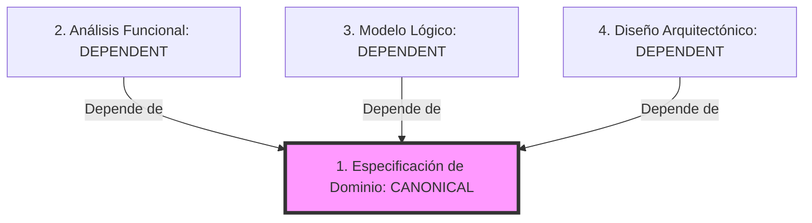

# Estándar Documental de Dominio - CajaFácil

Este documento define la estructura y el conjunto de documentos obligatorios que debe poseer cualquier Bounded Context o Dominio del proyecto CajaFácil. Su objetivo es garantizar la consistencia, mantenibilidad y trazabilidad en el largo plazo para desarrolladores y agentes de Inteligencia Artificial (IA).

---

## 1. Documentos Obligatorios por Dominio

Cada dominio que se incorpore o refactorice en CajaFácil debe contar con los siguientes 4 documentos técnicos estructurados:

### 1.1. Especificación del Dominio (Negocio)
*   **Nombre de Archivo:** `XX_DOMINIO_<NOMBRE_DOMINIO>.md` (ej. `07_DOMINIO_INVENTARIO.md`).
*   **Ubicación física:** `docs/business/`.
*   **Propósito:** Definir formalmente las reglas de negocio, invariantes, Aggregate Roots, Value Objects, excepciones de negocio y eventos del dominio de forma agnóstica a la tecnología.
*   **Responsable de Autoría:** Product Owner / Business Analyst.
*   **Rol en Trazabilidad:** `role: canonical` (Fuente única de verdad).

### 1.2. Análisis Funcional (Alcance y Casos de Uso)
*   **Nombre de Archivo:** `XX_ANALISIS_FUNCIONAL_<NOMBRE_DOMINIO>.md` (ej. `26_ANALISIS_FUNCIONAL_INVENTARIO.md`).
*   **Ubicación física:** `docs/business/`.
*   **Propósito:** Describir los límites del contexto (Context Boundaries), interacciones y flujos funcionales del MVP y de casos de uso operativos cotidianos.
*   **Responsable de Autoría:** Product Owner / Business Analyst.
*   **Rol en Trazabilidad:** `role: dependent` (Vinculado a su Dominio canónico).

### 1.3. Modelo Lógico de Datos (Base de Datos)
*   **Nombre de Archivo:** `XX_MODELO_LOGICO_<NOMBRES_DOMINIOS>.md` (ej. `17_MODELO_LOGICO_PRODUCTOS_INVENTARIO.md`).
*   **Ubicación física:** `docs/engineering/database/`.
*   **Propósito:** Definir el esquema relacional lógico (entidades, atributos, cardinalidades y restricciones) de forma conceptual sin referirse a tipos de datos físicos específicos de SQLite o PostgreSQL.
*   **Responsable de Autoría:** Lead Architect.
*   **Rol en Trazabilidad:** `role: dependent` (Vinculado a su Dominio canónico).

### 1.4. Diseño Arquitectónico (Implementación en Código)
*   **Nombre de Archivo:** `XX_DISENO_ARQUITECTONICO_<NOMBRE_DOMINIO>.md` (ej. `28_DISENO_ARQUITECTONICO_INVENTARIO.md`).
*   **Ubicación física:** `docs/engineering/architecture/`.
*   **Propósito:** Especificar la distribución de capas de Clean Architecture (domain, application, infrastructure, presentation), los diagramas de clases físicas, los contratos del repositorio SQLAlchemy y los controladores del enrutador.
*   **Responsable de Autoría:** Lead Architect / Backend Lead.
*   **Rol en Trazabilidad:** `role: dependent` (Vinculado a su Dominio canónico).

---

## 2. Mapa Conceptual de Relaciones y Trazabilidad

Los documentos no deben estar aislados; deben enlazarse utilizando el siguiente flujo de dependencias:



*   **Nota de Dependencia:** Todo documento dependiente debe colocar el bloque de alerta markdown al inicio referenciando su documento canónico:
    ```markdown
    > [!NOTE]
    > Este documento depende de la especificación canónica: [Dominio X](file:///docs/business/XX_DOMINIO_X.md).
    ```

---

## 3. Estándar YAML Frontmatter Obligatorio

Cada documento debe comenzar con el bloque YAML simplificado para control de ciclo de vida:

```yaml
---
id: CF-DOC-XXX                  # Identificador incremental
title: "Título Semántico"        # Nombre del documento
owner: "cto | lead-architect | backend-lead | product-owner"
status: "approved | historical | obsolete" # Estado del ciclo de vida
last_reviewed: YYYY-MM-DD       # Fecha de última revisión manual
role: "canonical | dependent | reference"
---
```
